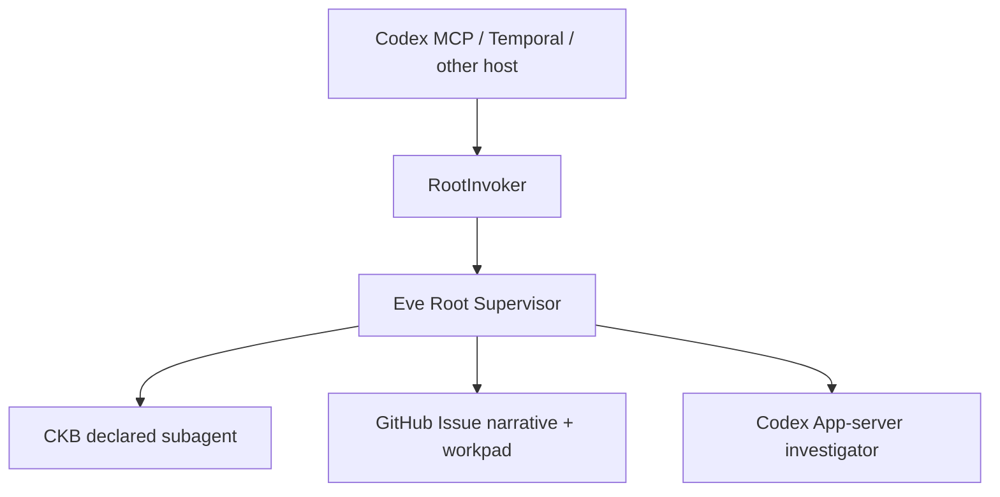

# FailureReport

FailureReport is an Eve-first Failure in the Loop system. It turns an incomplete
software failure into a durable, evidence-backed report whose shared context lives
in one GitHub Issue from intake through Todo promotion.

## Core Model



- Eve Root is the only public supervisor and public agent entry.
- CKB is the first declared Eve subagent, never a public API target.
- A target-repository GitHub Issue is the shared context: existing human body is
  preserved, FailureReport adds a stable narrative block, and exactly one marked
  comment holds the full structured snapshot.
- The workpad `revision` and Issue `updated_at` make stale writes explicit. The
  MVP lifecycle state is `FailureReport.status`; a host may project it to labels
  or Project V2 without changing the protocol.
- Codex App-server is the default deep-work backend invoked by Root. It is not
  forced into Eve's model slot.
- MCP, Temporal, and Codex integrations call Root through the typed runtime port.

## Workspace

```text
apps/failure-report       Eve Root, CKB subagent, and Root-owned integrations
packages/protocol         Zod schemas and workpad serialization
packages/runtime-port     Thin RootInvoker contract
packages/mcp-adapter      Root-only MCP translation
packages/temporal-adapter Deterministic Temporal workflow and activities
packages/codex-plugin     Codex skill bundle
examples/                 Extension and host examples
```

## Development

Node 24 and pnpm 10 are required.

```bash
pnpm install
pnpm build
pnpm check
pnpm test
```

Eve needs a configured AI SDK model credential for Root turns. The default
investigation backend separately uses local Codex App-server authentication.

To run the public Root MCP surface locally, start Eve Root in one terminal and
the MCP host in another:

```bash
pnpm --filter @failure-report/agent dev
pnpm --filter @failure-report/agent mcp
```

`FAILURE_REPORT_EVE_HOST` can point the MCP process at a deployed Root; set
`FAILURE_REPORT_EVE_BEARER_TOKEN` when that eve channel requires bearer auth.

## Extend

Add a domain subagent under `apps/failure-report/agent/subagents/<domain>/`.
It needs its own `agent.ts` description, instructions, config, skills, tools,
and fixtures. Do not expose its id through MCP or Temporal.

Add a transport at `packages/<name>-adapter/`. It may depend on `protocol` and
`runtime-port` only, converts external events into `RootRequest`, and returns a
`RootResult`. It must not implement FailureReport business logic or call a domain
subagent directly.

See [architecture overview](docs/architecture/overview.md),
[custom subagents](examples/add-custom-subagent/README.md), and
[Temporal host](examples/temporal-host/README.md) for the concrete extension
points.
