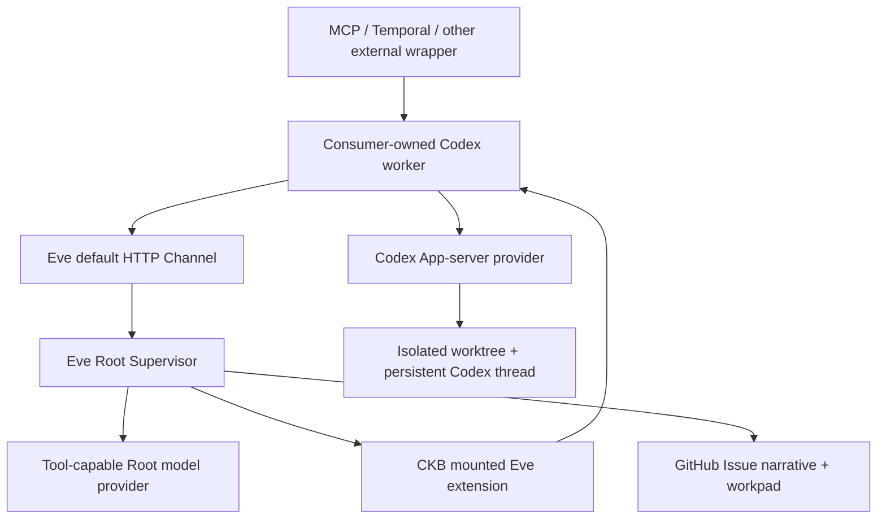

# FailureReport

FailureReport is an Eve-supervised Failure in the Loop system. It turns an
incomplete software failure into a durable, evidence-backed report whose shared
context lives in one GitHub Issue from intake through Todo promotion.

> **Provider boundary:** FailureReport is local-first by default: Root runs Eve
> with `experimental_chatgpt()` from the local Codex/ChatGPT session, while the
> mounted CKB extension prepares a consumer-owned Codex worker in a durable
> isolated worktree. See [provider boundary](docs/architecture/provider-boundary.md)
> for the contract.

## Core Model



- Eve Root is the only public supervisor. Its primary public entry is Eve's
  built-in HTTP channel, declared at `eve/agent/channels/eve.ts` and exposed as
  `/eve/v1/session*`.
- Root uses a **tool-capable** AI SDK model so Eve can retain Issue, approval,
  routing, and declared-subagent tools. The MVP runs locally by default, using
  Eve's `experimental_chatgpt()` helper with the signed-in Codex/ChatGPT session;
  this is the product default, not a test-only convenience. A remote host may opt
  into another tool-capable provider later.
- CKB is the first mounted Eve extension, never a public API target. Its
  `ckb__prepare_execution` tool owns CKB-specific approval, instructions, and
  delegation guidance; the consumer-owned Codex worker supplies the persistent
  Codex thread inside an isolated worktree.
- A target-repository GitHub Issue is the shared context: existing human body is
  preserved, FailureReport adds a stable narrative block, and exactly one marked
  comment holds the full structured snapshot.
- Root owns GitHub as an internal integration. Octokit is the default API
  transport; by default it reuses the active local `gh auth login` identity once
  per process, then performs Issue and comment calls through the SDK.
- The workpad `revision` and Issue `updated_at` make stale writes explicit. The
  MVP lifecycle state is `FailureReport.status`; a host may project it to labels
  or Project V2 without changing the protocol.
- Codex App-server's `threadId`, assigned worktree identity, branch, and Git
  revision are durable execution state, distinct from GitHub shared context.
- MCP and Temporal are outer packages that wrap the default Eve Channel for
  their own ecosystems; they do not create a second agent entry inside `eve/`.

## Workspace

```text
eve/agent                 Eve-discovered Root, Channel, tools, workers, and import-only authored helpers
eve/config                Application-owned Root and worker configuration
eve/evals                 Eve evaluations and immutable evaluation fixtures
packages/ckb-domain-pack  Reusable CKB Eve extension
packages/protocol         Zod schemas, Root invocation type, and workpad serialization
packages/mcp-adapter      MCP stdio wrapper that calls the default Eve Channel
packages/temporal-adapter Deterministic Temporal workflow and activities
packages/codex-plugin     Codex skill bundle
examples/                 Extension and host examples
```

`eve/agent/` is intentionally limited to Eve's filesystem
slots: `agent.ts`, `instructions.md`, `tools/`, `skills/`, `extensions/`, `lib/`
when shared authored code is needed, and declared `subagents/`. The Root runtime,
generic execution helpers, and GitHub integration now live under `agent/lib/`:
they are import-only authored code and are never mounted into a worker workspace.
Product configuration and evaluation material remain alongside `agent/`.

## Development

Node 24 and pnpm 10 are required.

```bash
pnpm install
pnpm build
pnpm check
pnpm test
```

FailureReport's MVP is a local product runtime. It uses the same `codex login`
credentials in two distinct roles: a tool-capable Eve Root model via
`experimental_chatgpt()`, and a Codex App-server provider for the coding worker.
The latter must be given an isolated worktree and must not be used as the Root
model, because it does not support AI SDK custom tool schemas.

To run the public Root MCP surface locally, start Eve (and therefore its default
Channel) in one terminal, then start the external MCP wrapper in another:

```bash
pnpm --filter @Alive24/FailureReport dev
pnpm --filter @failure-report/mcp-adapter mcp
```

`FAILURE_REPORT_EVE_HOST` can point the MCP process at a deployed Root; set
`FAILURE_REPORT_EVE_BEARER_TOKEN` when that eve channel requires bearer auth.
Set `FAILURE_REPORT_WORKTREE_ROOT` to choose where Root-owned isolated domain
worktrees live; otherwise the local default is `~/.failure-report/worktrees`.

## GitHub Runtime Authentication

Octokit is the GitHub API client; it does not require users to create or install
a GitHub App. The default runtime path expects `gh` to be installed and logged
in on the machine that runs Eve Root:

```bash
gh auth login
```

When Root first needs GitHub, it reads the active CLI credential with `gh auth
token` once in that process, keeps it only in memory, and passes it to Octokit.
All Issue and comment reads/writes then use Octokit, not `gh api`. This applies
equally to local MCP and Temporal-backed Root execution; each Root host needs
its own active `gh` login by default.

Runtime configuration is optional for that common path. These alternatives are
available when a host cannot use a CLI login:

| Setting                                                                                                    | Purpose                                                                                                                                                                                       |
| ---------------------------------------------------------------------------------------------------------- | --------------------------------------------------------------------------------------------------------------------------------------------------------------------------------------------- |
| `FAILURE_REPORT_GITHUB_AUTH=token` + `GITHUB_TOKEN`                                                        | Inject a runtime token into Octokit.                                                                                                                                                          |
| `FAILURE_REPORT_GITHUB_AUTH=app` + `GITHUB_APP_ID`, `GITHUB_APP_PRIVATE_KEY`, `GITHUB_APP_INSTALLATION_ID` | Use a GitHub App installation through Octokit. This is the preferred credential model for centrally operated multi-user or self-hosted deployments, but is never required for ordinary users. |
| `FAILURE_REPORT_GITHUB_GATEWAY=gh-cli`                                                                     | Explicit legacy `gh api` fallback for local diagnostics or fixture capture; it is not the default transport.                                                                                  |
| `FAILURE_REPORT_GITHUB_HOST`, `FAILURE_REPORT_GITHUB_API_URL`                                              | Select a `gh` host and/or GitHub Enterprise API base URL.                                                                                                                                     |

All credentials belong in runtime environment/secret management only. FailureReport
does not put tokens, App private keys, or credential output into the protocol,
workpad, prompts, logs, or fixtures.

## Extend

Add a domain as an Eve extension, starting with
`npx eve@latest extension init <domain>`. Keep its reusable capabilities in
`packages/<domain>-domain-pack/extension/`: `extension.ts`, tools, skills,
instructions, hooks, connections, and `lib/`. Mount it from
`eve/agent/extensions/<domain>.ts`; its contributions compose
under `<domain>__` names. Extensions cannot own an agent config, sandbox,
schedules, or nested extensions, so the application retains provider/worktree
policy and a generic Codex worker under `agent/subagents/`. Do not expose a
domain id through MCP or Temporal. A Codex App-server worker must not rely on
Eve-authored tools being callable by its model; provide domain guidance in the
prepared delegation and use its shell, MCP, and worktree-scoped capabilities.

Add an external wrapper at `packages/<name>-adapter/`. It converts platform
events into `RootRequest`, calls the default Eve Channel, and returns a
`RootResult`. It must not import `eve/agent`, implement FailureReport business
logic, or call a domain subagent directly. Temporal Workflow code remains
deterministic; its Activity is the outer boundary that invokes the Channel.

See [architecture overview](docs/architecture/overview.md),
[provider boundary](docs/architecture/provider-boundary.md),
[custom subagents](examples/add-custom-subagent/README.md), and
[Temporal host](examples/temporal-host/README.md) for the concrete extension
points.
