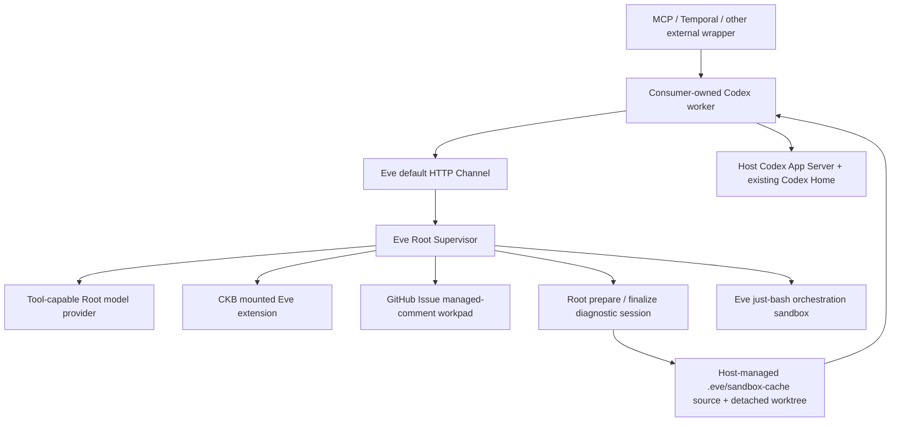

# FailureReport

FailureReport is an Eve-supervised Failure in the Loop system. It turns an incomplete software failure into a durable, evidence-backed report whose shared context lives in one GitHub Issue from intake through Todo promotion.

> **Provider boundary:** FailureReport is local-first by default: Root runs Eve with `experimental_chatgpt()` from the local Codex/ChatGPT session. The mounted CKB extension supplies domain capability, while Root prepares a durable diagnostic worktree for the one consumer-owned Codex worker. See [provider boundary](docs/architecture/provider-boundary.md) for the contract.

## Core Model



- Eve Root is the only public supervisor. Its primary public entry is Eve's built-in HTTP channel, declared at `eve/agent/channels/eve.ts` and exposed as `/eve/v1/session*`.
- Root uses a **tool-capable** AI SDK model so Eve can retain Issue, routing, and declared-subagent tools. The MVP runs locally by default, using Eve's `experimental_chatgpt()` helper with the signed-in Codex/ChatGPT session; this is the product default, not a test-only convenience. A remote host may opt into another tool-capable provider later.
- CKB is the first mounted Eve extension, never a public API target. It provides CKB instructions, the `failure-report-ckb-debugging` native skill, and deterministic `ckb__recommend_log`; it does not own a worktree, sandbox, or subagent.
- `prepare_diagnostic_session` accepts a report bound to a repository and full immutable Git SHA, resolves a Root-selected non-empty `domain_extensions` set, and manages the source cache plus detached diagnostic worktree only under the repository's `.eve/sandbox-cache/`. It places every selected native skill under `.agents/skills/` and persists worktree/HEAD/Codex-thread state before delegating to the one `codex` worker. After a worker finish, Root—not Codex—reconciles one immutable completion record through a bounded read–merge–write–readback transaction. Codex decides how to use the loaded skills; extensions never select a backend. Reachable deployment credentials and network policy, rather than a Root approval loop, control access to external systems.
- `finalize_diagnostic_session` creates and pushes `diagnostic/<target-issue-number>-<issue-title-slug>` only after the diagnostic worktree is clean. It does not check the branch out or force-move an existing ref. The workpad labels it a diagnostic-only snapshot: future coding must use a separate implementation worktree/branch and must not open a PR directly from the snapshot.
- A target-repository GitHub Issue is shared context: FailureReport never edits its body or a foreign comment. A managed comment is trusted only when its marker, v2 entry envelope, configured producer identity, and live immutable GitHub author identity agree.
- Root owns GitHub as an internal integration. Octokit is the default API transport; by default it reuses the active local `gh auth login` identity once per process, then performs Issue and comment calls through the SDK.
- The workpad records an append-only logical lineage. The same verified producer appends a new immutable entry to its comment; a different configured producer creates a linked successor comment without modifying the predecessor. Any copied marker, malformed entry, unknown producer, conflicting lineage, or fork becomes `needs_input`.
- Codex App Server's `threadId`, assigned worktree identity, Git revision, immutable Root-owned completion records, and optional finalized diagnostic snapshot are durable report/session state, distinct from GitHub shared context. Replayed finishes recognize the same completion record; incompatible duplicate payloads require input rather than replacing evidence.
- MCP and Temporal are outer packages that wrap the default Eve Channel for their own ecosystems; they do not create a second agent entry inside `eve/`.

## Workspace

```text
eve/agent                 Eve-discovered Root, Channel, tools, workers, and import-only authored helpers
eve/config                Application-owned Root and worker configuration
eve/evals                 Eve evaluations and immutable evaluation fixtures
packages/ckb-domain-pack  Reusable CKB Eve extension
packages/protocol         Zod schemas, Root invocation type, and workpad serialization
packages/mcp-adapter      MCP stdio wrapper that calls the default Eve Channel
packages/temporal-adapter Deterministic Temporal workflow and activities
packages/codex-plugin/failure-report  Installable Codex plugin and Eve-backed MCP configuration
examples/                 Extension and host examples
.eve/sandbox-cache/       Root-owned host source caches and detached diagnostic worktrees (runtime state)
```

`eve/agent/` is intentionally limited to Eve's filesystem slots: `agent.ts`, `instructions.md`, `tools/`, `skills/`, `extensions/`, `lib/` when shared authored code is needed, and declared `subagents/`. The Root runtime, generic diagnostic-session helpers, and GitHub integration now live under `agent/lib/`: they are import-only authored code and are never mounted into a worker workspace. Product configuration and evaluation material remain alongside `agent/`.

## Development

Node 24 and pnpm 10 are required.

```bash
pnpm install
pnpm build
pnpm check
pnpm test
```

To verify native Codex skill discovery locally without starting a model turn, run the opt-in App Server smoke test. It creates a temporary Git worktree, links the CKB skill beneath `.agents/skills`, and performs the same bounded `initialize` plus `skills/list` exchange that Root uses:

```bash
FAILURE_REPORT_RUN_CODEX_APP_SERVER_SMOKE=1 pnpm --filter @Alive24/FailureReport test -- codex-native-skill.smoke.test.ts
```

FailureReport's MVP is a local product runtime. It uses the same `codex login` credentials in two distinct roles: a tool-capable Eve Root model via `experimental_chatgpt()`, and a Codex App Server provider for the diagnostic worker. The latter must be given an isolated worktree and must not be used as the Root model, because it does not support AI SDK custom tool schemas.

To use the public Root MCP surface through Codex, start Eve (and therefore its default Channel) in one terminal:

```bash
pnpm --filter @Alive24/FailureReport dev
```

The command above runs `eve dev --no-ui`; when `FAILURE_REPORT_EVE_HOST` is unset, the adapter-owned local default is `http://127.0.0.1:2000`. This fallback is only for that local development path. Then load the repository-local Codex plugin at `packages/codex-plugin/failure-report`. Its `.mcp.json` starts the external `@failure-report/mcp-adapter` wrapper, which exposes the single `failure_report` tool and calls the default Eve Channel. `FAILURE_REPORT_EVE_HOST` can point the wrapper at a deployed Root, and `FAILURE_REPORT_EVE_BEARER_TOKEN` remains optional for Channels that require bearer auth.

The local MCP wrapper persists only Eve's serialized session cursor in a user-private state file, so an existing-Issue retry can resume after the wrapper process restarts. Set `FAILURE_REPORT_MCP_SESSION_STORE` to place that file on a managed state volume; it contains continuation tokens and should remain readable only by the operating user. The public request contract never accepts a session-store path.

For a local diagnosis, Root accepts only a repository identity and a full immutable Git SHA. It never accepts a source checkout path, cache path, worktree path, branch, or Codex `cwd`. Root derives the canonical remote, then manages this fixed host-owned hierarchy inside the FailureReport checkout:

```text
.eve/sandbox-cache/
  sources/<canonical-repository-cache>
  worktrees/<diagnostic-session>
```

The actual `git clone`, `git fetch`, `git worktree`, test, and package-manager commands run in the host runtime. Eve is pinned to `just-bash` for Root orchestration; its virtual shell is not a replacement Git runtime. Root's host-side diagnostics adapters inspect the controlled workspace and Codex App Server runs directly on the host with the validated worktree as `cwd`, retaining the user's existing `~/.codex`, plugins, skills, MCP settings, authentication, Git credentials, model configuration, and thread persistence. No path-setting environment variable is supported for this boundary.

### Codex diagnostic runtime preflight

Before every new or resumed diagnostic delegation, Root first creates or restores the managed worktree and selected native-skill links. It then starts the configured `codex app-server` with that worktree as `cwd`, inheriting the ambient host runtime unchanged, performs only `initialize` and `skills/list`, verifies every Root-selected repository skill, and terminates the child. This gate never creates a Codex thread, sends a model request, invokes a native tool, creates a diagnostic branch, or changes target-repository business files.

For normal-host startup, run Root from a terminal or service context where the existing Codex runtime can already start `codex app-server` and access its normal sign-in and persistent state. Root does not set, copy, or repair `CODEX_HOME`, credentials, permissions, or global Codex configuration.

If Root runs inside a restrictive desktop-process context, the readiness check cleans up its child. Only a transient startup, handshake, transport, or timeout failure receives one fresh-process retry; state-access and credential failures return sanitized `needs_input` immediately. No failure can start a diagnostic turn. Move the Root host to a normal terminal or service context that already has the required Codex runtime access, resolve any sign-in or operating-system permission issue outside FailureReport, and retry; do not copy state or loosen permissions from within FailureReport.

## GitHub Runtime Authentication

Octokit is the GitHub API client; it does not require users to create or install a GitHub App. The default runtime path expects `gh` to be installed and logged in on the machine that runs Eve Root:

```bash
gh auth login
```

When Root first needs GitHub, it reads the active CLI credential with `gh auth token` once in that process, keeps it only in memory, and passes it to Octokit. All Issue and comment reads/writes then use Octokit, not `gh api`. This applies equally to local MCP and Temporal-backed Root execution; each Root host needs its own active `gh` login by default.

Diagnostic source acquisition is separate from the GitHub API client: Root runs `git clone` and `git fetch` through the host's ordinary Git runtime, only inside its Root-owned `.eve/sandbox-cache/sources/` cache. A public or private repository is supported whenever that runtime can reach and authenticate to the canonical remote. Configure ordinary host Git authentication externally; FailureReport never writes credentials into a report, workpad, plugin configuration, or log.

Runtime configuration is optional for that common path. These alternatives are available when a host cannot use a CLI login:

| Setting | Purpose |
| --- | --- |
| `FAILURE_REPORT_GITHUB_AUTH=token` + `GITHUB_TOKEN` | Inject a runtime token into Octokit. |
| `FAILURE_REPORT_GITHUB_AUTH=app` + `GITHUB_APP_ID`, `GITHUB_APP_PRIVATE_KEY`, `GITHUB_APP_INSTALLATION_ID` | Use a GitHub App installation through Octokit. This is the preferred credential model for centrally operated multi-user or self-hosted deployments, but is never required for ordinary users. |
| `FAILURE_REPORT_GITHUB_GATEWAY=gh-cli` | Explicit legacy `gh api` fallback for local diagnostics or fixture capture; it is not the default transport. |
| `FAILURE_REPORT_GITHUB_HOST`, `FAILURE_REPORT_GITHUB_API_URL` | Select a `gh` host and/or GitHub Enterprise API base URL. |
| `FAILURE_REPORT_GITHUB_WORKPAD_PRODUCER_ID` + `FAILURE_REPORT_GITHUB_WORKPAD_PRODUCER_ACTOR_ID` | Required together to identify Root's current managed-comment producer with GitHub's immutable numeric actor ID. |
| `FAILURE_REPORT_GITHUB_WORKPAD_PRODUCERS` | Optional JSON object mapping every approved producer ID to its immutable GitHub actor ID, for example `{"root-gh":"101","root-app":"202"}`. |

All credentials belong in runtime environment/secret management only. FailureReport does not put tokens, App private keys, credential output, host-local paths, or raw private evidence into the public workpad, prompts, logs, or fixtures. Non-public evidence must be retained outside GitHub and referenced only through an opaque handle.

## Team-authorized GitHub Issue Channel

The optional GitHub Issue Channel is a separate Eve-native ingress at `/eve/v1/github`. It does not change the default HTTP Channel in `eve/agent/channels/eve.ts`: the HTTP Channel remains governed by deployment reachability and its configured HTTP authentication. This Channel uses Eve's verified GitHub App webhook handling and only dispatches Issue timeline comments from active members of configured organization teams.

It is disabled unless `FAILURE_REPORT_GITHUB_CHANNEL_POLICY` is configured. The policy is deployment-owned JSON; no Issue, Root request, MCP caller, Temporal caller, or model can select a repository, organization, team, credential, or policy path.

```bash
export FAILURE_REPORT_GITHUB_CHANNEL_BOT_NAME="failure-report"
export FAILURE_REPORT_GITHUB_CHANNEL_POLICY='{
  "repositories": [
    {
      "repository": "Acme/FailureReport",
      "organization": "Acme",
      "team_slugs": ["failure-report-operators"]
    }
  ]
}'
```

`GITHUB_APP_SLUG` is an accepted fallback for `FAILURE_REPORT_GITHUB_CHANNEL_BOT_NAME`. Policy parsing rejects malformed entries, repository/organization mismatches, duplicate repositories, empty team lists, and repeated or invalid team slugs. Keep the policy in deployment configuration, not an Issue, workpad, model context, or adapter payload.

### GitHub App setup

Use Eve's native GitHub App credentials in deployment secret management:

```bash
GITHUB_APP_ID=...
GITHUB_APP_PRIVATE_KEY=...
GITHUB_WEBHOOK_SECRET=...
```

Point the App webhook at `https://<deployment>/eve/v1/github` and subscribe to **Issue comments** (`issue_comment`) only. Give the installation access to each configured repository, repository **Issues: read and write** for Issue replies and optional reactions, and organization **Members: read** for the per-comment team-membership lookup. GitHub App metadata read access is automatic. Do not grant Contents, Pull requests, Checks, Actions/Workflows, or broader organization permissions for this Channel.

### Vercel Connect (optional)

An Eve-supported Vercel Connect deployment can supply `connectGitHubCredentials("github/<uid>")` to the exported `createGithubIssueChannel()` factory instead of App-key environment variables. Connect supplies the installation token and verified-webhook provider, so keep its UID and all credential material in deployment configuration. Attach its trigger to `/eve/v1/github`, subscribe only to `issue_comment`, and grant the managed App the same repository **Issues: read and write** and organization **Members: read** access above. The policy gate and Root-only workspace boundary are unchanged.

For every initial `@failure-report` mention and every accepted direct missing-input reply, the Channel uses the webhook installation token to call `GET /orgs/{org}/teams/{team_slug}/memberships/{username}` for every configured team. Only a returned `state: "active"` authorizes Root. Pending or absent membership, an unconfigured repository, missing `Members: read`, a GitHub API failure, a malformed delivery, or failed webhook verification all fail closed. A lookup failure emits only the fixed operator outcome code `failure-report.github-issue-channel.authorization-lookup-failed`, at most once per process; it never logs raw GitHub data, policy, or credentials. Rejections intentionally do not tell a commenter which policy or credential check failed.

The Channel ignores PR timeline comments, review comments, Issue-open events, CI events, schedules, proactive sends, and ordinary unmentioned Issue comments. A direct reply is accepted only when the running Channel has exactly one known `ask_question` missing-information request for that Issue and the reply unambiguously answers it. Approval prompts and ambiguous correlations are never continued through GitHub. Membership is rechecked for every accepted reply; authorization is never cached.

Eve's stock GitHub Channel would check a repository out on `turn.started`. FailureReport replaces just that handler: it can retain the bounded `eyes` progress reaction and native Issue replies, but it never asks Eve for a sandbox, clones, fetches, selects a revision, sets a remote, or passes a checkout path to Root or Codex. Root remains the sole owner of `.eve/sandbox-cache/` source and diagnostic-worktree lifecycle.

### GitHub Channel UAT

Before enabling this ingress in production, install a test App on a configured test repository and verify all of the following:

- An active configured-team member can mention the bot in an Issue and receives a Root reply; then directly answer one known missing-information prompt without another mention.
- A non-member, pending member, unconfigured repository, invalid webhook, revoked App access, and missing `Members: read` do not dispatch or continue Root and do not reveal policy details.
- PR/review/CI/Issue-open events and ordinary Issue comments do not start a turn.
- No Eve sandbox checkout is created; any diagnostic source or worktree is created only by Root's managed lifecycle.

## Managed GitHub Workpads

Every public workpad entry carries a versioned envelope with its immutable producer, logical session, entry identity, revision, and any predecessor-comment reference. The concise status summary appears before a folded, schema-validated JSON snapshot. Root rehydrates only one valid linear lineage; it never migrates a legacy marker-only comment or guesses between candidates.

## Extend

Add a domain as an Eve extension, starting with `npx eve@latest extension init <domain>`. Keep its reusable capabilities in `packages/<domain>-domain-pack/extension/`: `extension.ts`, tools, skills, instructions, hooks, connections, and `lib/`. Mount it from `eve/agent/extensions/<domain>.ts`; its contributions compose under `<domain>__` names. Extensions cannot own an agent config, sandbox, schedules, or nested extensions, so the application retains diagnostic-session policy and one generic Codex worker under `agent/subagents/`. Register each extension's installed native skill assets in Root's fixed `domain_extensions` registry; Root then materializes safe `.agents/skills` symlinks for the selected set in each diagnostic worktree. Do not expose extension selection through MCP or Temporal. A Codex App Server worker must not rely on Eve-authored tools being callable by its model; the prepared delegation starts with all selected native `$skill` invocations and it uses shell, MCP, and worktree-scoped capabilities.

Add an external wrapper at `packages/<name>-adapter/`. It converts platform events into `RootRequest`, calls the default Eve Channel, and returns a `RootResult`. It must not import `eve/agent`, implement FailureReport business logic, or call a domain subagent directly. Temporal Workflow code remains deterministic; its Activity is the outer boundary that invokes the Channel.

See [architecture overview](docs/architecture/overview.md), [provider boundary](docs/architecture/provider-boundary.md), [custom subagents](examples/add-custom-subagent/README.md), and [Temporal host](examples/temporal-host/README.md) for the concrete extension points.

## Shea Symphony

SHEA_SYMPHONY_APP_PROFILE_PATH="$PWD/.shea/app-profile.json" ./.shea/app/shea-symphony-app
