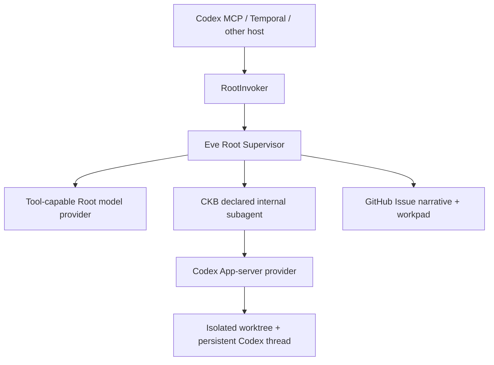

# FailureReport

FailureReport is an Eve-supervised Failure in the Loop system. It turns an
incomplete software failure into a durable, evidence-backed report whose shared
context lives in one GitHub Issue from intake through Todo promotion.

> **Provider boundary:** FailureReport is local-first by default: Root runs Eve
> with `experimental_chatgpt()` from the local Codex/ChatGPT session, while the
> internal CKB subagent runs Codex App-server in a durable isolated worktree. See
> [provider boundary](docs/architecture/provider-boundary.md) for the contract.

## Core Model



- Eve Root is the only public supervisor and public agent entry.
- Root uses a **tool-capable** AI SDK model so Eve can retain Issue, approval,
  routing, and declared-subagent tools. The MVP runs locally by default, using
  Eve's `experimental_chatgpt()` helper with the signed-in Codex/ChatGPT session;
  this is the product default, not a test-only convenience. A remote host may opt
  into another tool-capable provider later.
- CKB is the first declared Eve subagent, never a public API target. Its execution
  provider is Codex App-server, so coding work happens in a persistent
  Codex thread inside an isolated worktree.
- A target-repository GitHub Issue is the shared context: existing human body is
  preserved, FailureReport adds a stable narrative block, and exactly one marked
  comment holds the full structured snapshot.
- The workpad `revision` and Issue `updated_at` make stale writes explicit. The
  MVP lifecycle state is `FailureReport.status`; a host may project it to labels
  or Project V2 without changing the protocol.
- Codex App-server's `threadId`, assigned worktree identity, branch, and Git
  revision are durable execution state, distinct from GitHub shared context.
- MCP, Temporal, and Codex integrations call Root through the typed runtime port.

## Workspace

```text
apps/failure-report       Eve Root, domain packs, and Root-owned integrations
packages/protocol         Zod schemas and workpad serialization
packages/runtime-port     Thin RootInvoker contract
packages/mcp-adapter      Root-only MCP translation
packages/temporal-adapter Deterministic Temporal workflow and activities
packages/codex-plugin     Codex skill bundle
examples/                 Extension and host examples
```

## Development

Node 24 and pnpm 10 are required.

```bash
pnpm install
pnpm build
pnpm check
pnpm test
```

FailureReport's MVP is a local product runtime. It uses the same `codex login`
credentials in two distinct roles: a tool-capable Eve Root model via
`experimental_chatgpt()`, and a Codex App-server provider for coding subagents.
The latter must be given an isolated worktree and must not be used as the Root
model, because it does not support AI SDK custom tool schemas.

To run the public Root MCP surface locally, start Eve Root in one terminal and
the MCP host in another:

```bash
pnpm --filter @failure-report/agent dev
pnpm --filter @failure-report/agent mcp
```

`FAILURE_REPORT_EVE_HOST` can point the MCP process at a deployed Root; set
`FAILURE_REPORT_EVE_BEARER_TOKEN` when that eve channel requires bearer auth.
Set `FAILURE_REPORT_WORKTREE_ROOT` to choose where Root-owned isolated domain
worktrees live; otherwise the local default is `~/.failure-report/worktrees`.

## Extend

Add a domain pack under `apps/failure-report/src/domain-packs/<domain>/`, then
register it in the Root's domain-pack registry and declare its Eve subagent at
`apps/failure-report/agent/subagents/<domain>/`. The pack owns the domain's
backend binding and execution instructions; `src/execution/` remains generic
Root-owned worktree, workpad, and resume infrastructure. Do not expose the
domain id through MCP or Temporal. A Codex App-server-backed child must not rely
on Eve-authored tools being callable by its model; give it the required shell,
MCP, and worktree-scoped capabilities directly.

Add a transport at `packages/<name>-adapter/`. It may depend on `protocol` and
`runtime-port` only, converts external events into `RootRequest`, and returns a
`RootResult`. It must not implement FailureReport business logic or call a domain
subagent directly.

See [architecture overview](docs/architecture/overview.md),
[provider boundary](docs/architecture/provider-boundary.md),
[custom subagents](examples/add-custom-subagent/README.md), and
[Temporal host](examples/temporal-host/README.md) for the concrete extension
points.
