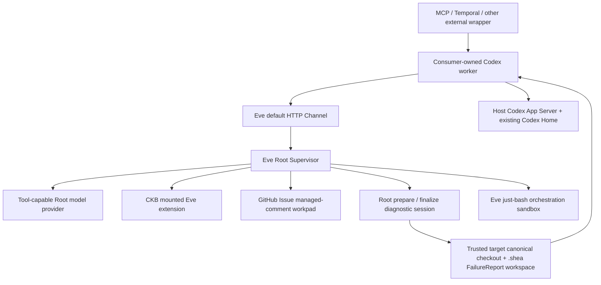

# FailureReport

FailureReport is an Eve-supervised Failure in the Loop system. It turns an incomplete software failure into a durable, evidence-backed report and publishes its human-readable implementation handoff in the same GitHub Issue, optionally routing that target repository's own Project item to Backlog or Todo.

> **Provider boundary:** FailureReport is local-first by default: Root runs Eve with `experimental_chatgpt()` from the local Codex/ChatGPT session. The mounted CKB extension supplies domain capability, while Root prepares a durable diagnostic worktree for the one consumer-owned Codex worker. See [provider boundary](docs/architecture/provider-boundary.md) for the contract.

## Core Model


```mermaid
flowchart TD
  M["MCP / Temporal / other external wrapper"] --> C["Eve Channel client"]
  C --> H["Eve default HTTP Channel"]
  H --> E["Eve Root Supervisor"]
  E --> R["Tool-capable Root model provider"]
  E --> X["CKB mounted Eve extension"]
  E --> I["GitHub Issue managed-comment workpad"]
  E --> D["Root prepare / finalize diagnostic session"]
  E --> B["Eve just-bash orchestration sandbox"]
  D --> W["Trusted target canonical checkout + .shea FailureReport workspace"]
  W --> C["Consumer-owned Codex worker"]
  C --> A["Host Codex App Server + existing Codex Home"]
```

- Eve Root is the only public supervisor. Its primary public entry is Eve's built-in HTTP channel, declared at `eve/agent/channels/eve.ts` and exposed as `/eve/v1/session*`.
- Root uses a **tool-capable** AI SDK model so Eve can retain Issue, routing, and declared-subagent tools. The MVP runs locally by default, using Eve's `experimental_chatgpt()` helper with the signed-in Codex/ChatGPT session; this is the product default, not a test-only convenience. A remote host may opt into another tool-capable provider later.
- CKB is the first mounted Eve extension, never a public API target. It provides CKB instructions, the `failure-report-ckb-debugging` native skill, and deterministic `ckb__recommend_log`; it does not own a worktree, sandbox, or subagent.
- One FailureReport process binds one canonical target checkout through the host-only `--target-workspace` startup option. `prepare_diagnostic_session` accepts only a report repository plus full immutable Git SHA and a Root-selected `domain_extensions` set; it verifies that the report matches the bound checkout, copies only missing authored defaults from `eve/config/failure-report/` into the target checkout's `.shea`, preserves every target customization, and creates the detached diagnostic worktree beneath `.shea/worktrees/failureReport/`. The set may be empty: the one generic `codex` worker then uses repository instructions and standard diagnostic capabilities without a synthetic core skill. When extensions are selected, Root places their native skills under `.agents/skills/`. Root persists only portable worktree identity/HEAD/Codex-thread state before delegation; the host path remains Root-private runtime state. After a worker finish, Root—not Codex—reconciles one immutable completion record through a bounded read–merge–write–readback transaction. Codex decides how to use selected skills; extensions never select a backend. Reachable deployment credentials and network policy, rather than a Root approval loop, control access to external systems.
- `finalize_diagnostic_session` creates and pushes `diagnostic/<target-issue-number>-<issue-title-slug>` only after the diagnostic worktree is clean. It does not check the branch out or force-move an existing ref. The workpad labels it a diagnostic-only snapshot: future coding must use a separate implementation worktree/branch and must not open a PR directly from the snapshot.
- `render_handoff` is a read-only, revision-bound operation. Root reloads the latest provenance-verified workpad and returns either a deterministic `failure-report/implementation-handoff/v1` for a finalized fully Ready diagnosis, or a `failure-report/human-input-request/v1` that preserves the active worktree and diagnostic thread. It never publishes, changes tracker state, creates a branch, or starts an implementation workflow.
- Tracker routing is optional deployment policy. A repository may configure Issue-comment handoff delivery without any Project; in that case `begin_failure_report` remains tracker-free and `deliver_handoff` never adds the Issue to a Project. When the target repository explicitly configures its own Project, intake moves to `Failure Report` and delivery may move only to `Backlog` or `Todo` after readback. `Backlog` stops for manual promotion; `Todo` hands ownership to a downstream implementation system such as Shea Symphony. FailureReport never skips directly to `Agent Review` or `Human Review`.
- A target-repository GitHub Issue is shared context: FailureReport never edits its body or a foreign comment. A managed comment is trusted only when its marker, v2 entry envelope, configured producer identity, and live immutable GitHub author identity agree.
- Every authoritative workpad revision starts with a deterministic, stage-aware human view derived from that revision's schema-validated report. Active diagnoses show current evidence, hypotheses, experiments, unknowns, and pending diagnostic actions; `Need Human Input` revisions preserve the complete question, material unknown, options, and resume condition; completed diagnoses show the diagnosis, confidence, evidence, residual uncertainty, remediation, and finalized diagnostic snapshot when present. Ordinary collections retain canonical order and show at most 10 items with an exact omitted count.
- Root owns GitHub as an internal integration. Octokit is the default API transport; by default it reuses the active local `gh auth login` identity once per process, then performs Issue and comment calls through the SDK.
- The workpad records an append-only logical lineage. The same verified producer appends while the provider-private encoded request remains within its safe budget, then creates an explicit capacity successor without modifying its predecessor. A different configured producer creates an explicit transition successor. A normal revision keeps the complete canonical JSON folded beneath its human view. An oversized revision is published as folded provisional content-addressed chunks and becomes visible only through a final manifest containing the same human semantics plus ordered reconstruction metadata. The manifest independently verifies chunk IDs, ordering, digests, producer, live author, logical session, revision, and predecessor. Incomplete groups never become runtime state. Any copied marker, malformed entry, unknown producer, conflicting lineage, chunk mismatch, or fork becomes `needs_input`.
- Codex App Server's `threadId`, assigned worktree identity, Git revision, immutable Root-owned completion records, and optional finalized diagnostic snapshot are durable report/session state, distinct from GitHub shared context. Replayed finishes recognize the same completion record; incompatible duplicate payloads require input rather than replacing evidence.
- `Ready` means no material unknown can change scope, solution, guardrails, acceptance criteria, or verification. Non-blocking concerns are recorded as residual risks. Material uncertainty keeps the session active and produces one precise human question plus an explicit same-session resume condition.
- MCP and Temporal are outer packages that wrap the default Eve Channel for their own ecosystems; they do not create a second agent entry inside `eve/`.

## Workspace

```text
eve/agent                 Eve-discovered Root, Channel, tools, workers, and import-only authored helpers
eve/config                Application-owned Root and worker configuration
eve/evals                 Eve evaluations and immutable evaluation fixtures
packages/ckb-domain-pack  Reusable CKB Eve extension
packages/protocol         Zod schemas, Root invocation type, and workpad serialization
packages/mcp-adapter      MCP stdio wrapper that calls the default Eve Channel
packages/temporal-adapter Deterministic Temporal workflow and activities
packages/codex-plugin/failure-report  Installable Codex plugin and Eve-backed MCP configuration
examples/                 Extension and host examples
eve/config/failure-report/     Authored default prompts, templates, and target ignore rule
.shea/                         Shea Symphony configuration for developing FailureReport itself
```

`eve/agent/` is intentionally limited to Eve's filesystem slots: `agent.ts`, `instructions.md`, `tools/`, `skills/`, `extensions/`, `lib/` when shared authored code is needed, and declared `subagents/`. The Root runtime, generic diagnostic-session helpers, and GitHub integration now live under `agent/lib/`: they are import-only authored code and are never mounted into a worker workspace. Product configuration and evaluation material remain alongside `agent/`. FailureReport's repository-root `.shea/` is exclusively for Shea Symphony to develop this repository; the product never treats it as a source of runtime defaults.

## Development

Node 24 and pnpm 10 are required. The repository pins Node 24.18.1 for nvm and `.node-version`-aware tools. pnpm also manages the pinned development runtime during install, records it in the lockfile, and uses it for scripts.

```bash
nvm install # optional; reads .nvmrc, installs Node 24.18.1 if needed, and selects it
pnpm install --frozen-lockfile
pnpm build
pnpm check
pnpm test
```

### Supported no-watch local runtime

Normal local operation uses the production Eve server and does not require a filesystem watcher:

```bash
pnpm install --frozen-lockfile
pnpm --filter @Alive24/FailureReport start -- --target-workspace /absolute/path/to/target-checkout
```

The `prestart` hook builds FailureReport's direct workspace dependencies and host-readiness code, then builds or refreshes Eve's production output. Before the server accepts work, the launcher verifies the absolute real Git top level, readable `origin`, `git fetch` authority, missing-only target `.shea` preparation, an actual create/remove probe beneath the ignored FailureReport worktree root, and the configured delivery policy/template when one applies to the bound repository. Successful preflight emits one redacted structured `failure-report.host-runtime-readiness` record and then runs `eve start` from a stable ignored `FailureReport/eve/.failure-report-runtime` app root. Its nested `.eve` workflow state survives ordinary restarts without sharing the authored app root's watcher/development state.

Startup failures emit only a boundary and safe category in structured private logs. Repair the corresponding host condition outside FailureReport and rerun the same command: canonical checkout/origin for `target_workspace_invalid`, checkout ownership for `target_workspace_write_denied`, Git credentials or network for `git_fetch_failed`, target `.shea` content for `target_assets_invalid`, the contained template for `handoff_template_invalid`, or deployment JSON for `delivery_policy_invalid`. The launcher does not change file-descriptor limits, credentials, Git configuration, target customizations, or operating-system permissions.

Repository identity and full immutable revision remain operation-specific. Root rechecks them before diagnostic delegation and handoff delivery; startup readiness never guesses either value.

### Watcher-based development

A fresh checkout needs no manually inferred whole-workspace build before starting the development watcher. Install the locked workspace and run:

```bash
pnpm install --frozen-lockfile
pnpm --filter @Alive24/FailureReport dev --target-workspace /absolute/path/to/target-checkout
```

`dev` first runs its `dev:preflight`, which builds `@failure-report/protocol` and `@failure-report/ckb-domain-pack` plus FailureReport's local host-readiness code. It then runs the same host-runtime readiness boundary as supported start, exports the canonical binding as `FAILURE_REPORT_TARGET_WORKSPACE`, and launches `eve dev --no-ui`. It remains a development-only watcher path.

The preflight may create ignored `dist/` output, and Eve may create ignored `.eve/` runtime-cache state. Neither is a dependency installation. Root is explicitly pinned to the declared `just-bash` dependency with automatic installation disabled, so this path must never run `pnpm add`, rewrite a package manifest or lockfile, or provision a Docker/microsandbox image or VM. Image or VM provisioning belongs only to an explicitly selected future sandbox backend; it is separate from build output and never a reason to mutate dependencies.

For a clean-checkout, non-interactive preflight smoke (which avoids a persistent dev watcher), run this in a disposable clone after the frozen install:

```bash
pnpm --filter @Alive24/FailureReport run dev:preflight
git status --short
git diff --check
```

The two Git commands must produce no output. On a host with ordinary watcher capacity, start `dev` normally and run the same Git checks after shutdown. An `EMFILE` watcher failure is recorded as `watcher_exhaustion`; use supported no-watch `start` or repair host capacity. It must not trigger dependency installation or metadata changes.

To verify native Codex skill discovery locally without starting a model turn, run the opt-in App Server smoke test. It creates a temporary Git worktree, links the CKB skill beneath `.agents/skills`, and performs the same bounded `initialize` plus `skills/list` exchange that Root uses:

```bash
FAILURE_REPORT_RUN_CODEX_APP_SERVER_SMOKE=1 pnpm --filter @Alive24/FailureReport exec vitest run test/codex-native-skill.smoke.test.ts
```

For an operator-owned Shea Halo candidate experiment, FailureReport also has one explicit real Root-to-Codex trace-capture command. It is dormant during ordinary runtime use and accepts only exact-revision fixture/candidate configuration with owner-only ignored output. See [Real Root-to-Codex trace capture](docs/operations/halo-real-trace-capture.md).

FailureReport's MVP is a local product runtime. It uses the same `codex login` credentials in two distinct roles: a tool-capable Eve Root model via `experimental_chatgpt()`, and a direct Codex App Server host transport for the diagnostic worker. The latter must be given an isolated worktree and must not be used as the Root model, because it does not support AI SDK custom tool schemas.

To use the public Root MCP surface through Codex, install the repository-local plugin at `packages/codex-plugin/failure-report` through a configured marketplace. Its `.mcp.json` starts the plugin-local bundled build of `@failure-report/mcp-adapter`, which exposes the single `failure_report` tool without requiring the source pnpm workspace and supervises runtime readiness before it calls the default Eve Channel.

In `managed-local` mode, an operator privately configures exact `owner/repository` to canonical-checkout mappings through `FAILURE_REPORT_TRUSTED_REPOSITORIES`. The adapter verifies the mapped checkout's Git top level and origin, reuses only a healthy Eve process whose authenticated binding matches, or starts the supported production command from repository source and waits boundedly for readiness. Concurrent startup is single-flight per repository and private state/logs survive adapter restart. In `remote` mode, the operator pins `FAILURE_REPORT_EVE_HOST` and `FAILURE_REPORT_REMOTE_REPOSITORY`; the adapter probes health and authenticated binding and never silently starts a local replacement. See the plugin README for the complete environment contract.

The Issue or public Root request can identify only a canonical repository and Issue. It cannot select a checkout, runtime root, state path, process, or log. Missing provisioning and failed readiness return sanitized operator recovery categories without starting Root, so retrying the same `request_id` after repair cannot create a competing diagnosis. Idle cleanup is permitted only for a supervisor-owned process with a matching instance proof and no active diagnostic session.

The local MCP wrapper keeps an adapter-private durable operation ledger beside Eve's serialized session cursor. Before it sends a Root turn, it records the canonical Issue/report session key, `request_id`, request fingerprint, and delivery owner; immediately after Eve accepts the turn, it records the allocated resumable session cursor before waiting for the terminal stream event. A terminal cursor with a valid `sessionId` advances that durable cursor. If a failed or waiting terminal event returns only an incomplete cursor, the wrapper stores the terminal result but retains the last delivered resumable cursor, so replay and later same-Issue work remain safe across restart. Legacy terminal ledgers with an incomplete cursor keep their replay records and start a fresh Eve session for later work; incomplete cursors attached to active delivered ownership still fail closed. A retry with the same `request_id` drains that delivered turn or replays its terminal result instead of sending again, while different requests for the same canonical key remain durably queued. Independent keys still run concurrently. Ambiguous or corrupt ownership fails closed rather than risking a second Root run.

Terminal records are compacted in bounded stages: by default, each canonical session retains 32 full request-bearing terminal records and 128 result-bearing cleaned records, then a fixed-size retired-request filter prevents an older cleaned `request_id` from being delivered again after its result is discarded. An embedding host can lower or raise those limits through `operation_retention`; full terminal retention may be zero, while cleaned-result retention must remain at least one so the completing caller can read its result. The stdio host uses the defaults. Version 1 cursor-only files migrate on their first write. Set `FAILURE_REPORT_MCP_SESSION_STORE` to place this private ledger on a managed state volume; it contains requests, results, Eve session IDs, continuation tokens, and adapter ownership metadata, so it must remain readable only by the operating user. The public Root request never accepts a ledger path or any of that private state.

For a local diagnosis, Root accepts only a repository identity and a full immutable Git SHA. It never accepts a source checkout path, cache path, worktree path, branch, or Codex `cwd`. The operator binds one canonical checkout when the FailureReport process starts; that binding is not part of a Root request, Channel payload, Issue, workpad, MCP call, extension, or model turn. Root verifies the binding is an absolute real Git top-level directory whose `origin` matches the report repository, fetches the requested immutable revision, and then bootstraps this target-owned hierarchy without overwriting existing files:

```text
<target-canonical-checkout>/.shea/
  prompts/failureReport/{intake.md,synthesis.md}
  template/failureReport/implementation.md
  worktrees/failureReport/<diagnostic-session>
```

The actual `git fetch`, `git worktree`, test, and package-manager commands run in the host runtime. Eve is pinned to `just-bash` for Root orchestration; its virtual shell is not a replacement Git runtime. Root's host-side diagnostics adapters inspect the controlled workspace and Codex App Server runs directly on the host with the validated worktree as `cwd`, retaining the user's existing `~/.codex`, plugins, skills, MCP settings, authentication, Git credentials, model configuration, and thread persistence.

The shared supported/development/demo launcher provides `--target-workspace` as the normal local interface. A service wrapper may set the equivalent `FAILURE_REPORT_TARGET_WORKSPACE` environment variable before starting Eve. The process serves only that repository until it exits; a report for another repository fails closed instead of selecting, cloning, or accepting another host path. `demo:start` uses the same production and host-readiness mechanisms but deliberately places Eve state in a fresh temporary app root; it is for isolated demonstrations, not durable normal operation.

The target `.shea/.../failureReport` hierarchy is a shared workspace convention, not a runtime dependency on Shea Symphony. FailureReport can create and use it independently; a later Shea workflow may consume the same handoff and project-owned configuration.

### Codex diagnostic runtime preflight

Before every new or resumed diagnostic delegation, Root first creates or restores the managed worktree and selected native-skill links. It then starts the configured `codex app-server` with that worktree as `cwd`, inheriting the ambient host runtime unchanged, performs only `initialize` and `skills/list`, verifies every Root-selected repository skill, and terminates the child. This gate never creates a Codex thread, sends a model request, invokes a native tool, creates a diagnostic branch, or changes target-repository business files.

For normal-host startup, run Root from a terminal or service context where the existing Codex runtime can already start `codex app-server` and access its normal sign-in and persistent state. Root does not set, copy, or repair `CODEX_HOME`, credentials, permissions, or global Codex configuration.

If Root runs inside a restrictive desktop-process context, the readiness check cleans up its child. Only a transient startup, handshake, transport, or timeout failure receives one fresh-process retry; state-access and credential failures return sanitized `needs_input` immediately. No failure can start a diagnostic turn. Move the Root host to a normal terminal or service context that already has the required Codex runtime access, resolve any sign-in or operating-system permission issue outside FailureReport, and retry; do not copy state or loosen permissions from within FailureReport.

## GitHub Runtime Authentication

Octokit is the GitHub API client; it does not require users to create or install a GitHub App. The default runtime path expects `gh` to be installed and logged in on the machine that runs Eve Root:

```bash
gh auth login
```

When Root first needs GitHub, it reads the active CLI credential with `gh auth token` once in that process, keeps it only in memory, and passes it to Octokit. All Issue and comment reads/writes then use Octokit, not `gh api`. This applies equally to local MCP and Temporal-backed Root execution; each Root host needs its own active `gh` login by default.

Diagnostic source access is separate from the GitHub API client: Root runs `git fetch` and `git worktree` through the host's ordinary Git runtime against the process-bound target checkout. A public or private repository is supported whenever that runtime can reach and authenticate to its canonical remote. Configure ordinary host Git authentication externally; FailureReport never writes credentials into a report, workpad, plugin configuration, or log.

Runtime configuration is optional for that common path. These alternatives are available when a host cannot use a CLI login:

| Setting | Purpose |
| --- | --- |
| `FAILURE_REPORT_GITHUB_AUTH=token` + `GITHUB_TOKEN` | Inject a runtime token into Octokit. |
| `FAILURE_REPORT_GITHUB_AUTH=app` + `GITHUB_APP_ID`, `GITHUB_APP_PRIVATE_KEY`, `GITHUB_APP_INSTALLATION_ID` | Use a GitHub App installation through Octokit. This is the preferred credential model for centrally operated multi-user or self-hosted deployments, but is never required for ordinary users. |
| `FAILURE_REPORT_GITHUB_GATEWAY=gh-cli` | Explicit legacy `gh api` fallback for local diagnostics or fixture capture; it is not the default transport. |
| `FAILURE_REPORT_GITHUB_HOST`, `FAILURE_REPORT_GITHUB_API_URL` | Select a `gh` host and/or GitHub Enterprise API base URL. |
| `FAILURE_REPORT_GITHUB_WORKPAD_PRODUCER_ID` + `FAILURE_REPORT_GITHUB_WORKPAD_PRODUCER_ACTOR_ID` | Required together to identify Root's current managed-comment producer with GitHub's immutable numeric actor ID. |
| `FAILURE_REPORT_GITHUB_WORKPAD_PRODUCERS` | Optional JSON object mapping every approved producer ID to its immutable GitHub actor ID, for example `{"root-gh":"101","root-app":"202"}`. |
| `FAILURE_REPORT_TARGET_WORKSPACE` | Required process-level canonical checkout binding. The local `--target-workspace` launcher option sets it; public requests can never change it. |
| `FAILURE_REPORT_HANDOFF_DELIVERY_POLICY` | Optional repository handoff policy. A repository can publish an Issue comment without a tracker, or explicitly bind its own GitHub Project v2. |

All credentials belong in runtime environment/secret management only. FailureReport does not put tokens, App private keys, credential output, host-local paths, or raw private evidence into the public workpad, prompts, logs, or fixtures. Non-public evidence must be retained outside GitHub and referenced only through an opaque handle.

### Tracker routing and handoff delivery

Create a `Failure Report` option in the target repository's own GitHub Project `Status` field only when Project routing is desired. This diagnostic state belongs to the tracker, not Shea Symphony's workflow `state_map`: Shea claims only its own downstream states such as `Todo` and `Rework`. A target Issue is never added to FailureReport's Project.

The delivery policy is deployment-owned JSON. Root requests and models provide only an Issue identity and revision binding; they cannot choose a template, Project, field, or destination.

```bash
export FAILURE_REPORT_HANDOFF_DELIVERY_POLICY='{
  "schema_version": "failure-report/handoff-delivery-policy/v1",
  "repositories": [
    {
      "repository": "Acme/Application",
      "tracker": {
        "kind": "github_project_v2",
        "project_owner": "Acme",
        "project_owner_type": "organization",
        "project_number": 12,
        "status_field": "Status",
        "intake_state": "Failure Report",
        "ready_destination": "Backlog"
      }
    }
  ]
}'
```

Set `ready_destination` to `Backlog` when a person should promote the completed report manually, or to `Todo` when a downstream system may claim it immediately. `Agent Review`, `Human Review`, `Merging`, and `Done` are intentionally invalid destinations because they require real downstream work and evidence.

Omitting `template` selects `.shea/template/failureReport/implementation.md` in the target canonical checkout. FailureReport copies its own default only when that target file is missing, then canonicalizes the selected path, requires a contained regular file, and rejects traversal or symlink escape. The target file controls only the human-readable part of the new comment; FailureReport always appends the full versioned structured handoff and delivery intent in a folded JSON block. Template variables are validated, and the machine-readable `failure-report/implementation-handoff/v1` schema never changes with presentation.

To publish a handoff comment without adding the target Issue to any Project, configure only the repository:

```json
{
  "schema_version": "failure-report/handoff-delivery-policy/v1",
  "repositories": [{ "repository": "Alive24/CKBoost" }]
}
```

The active GitHub credential needs Issue comment write access and GitHub Project v2 read/write access for every configured Project. A missing Project, status field, `Failure Report`/`Backlog`/`Todo` option, or insufficient credential fails closed. Handoff-comment retry uses a deterministic marker and never edits another user's comment; tracker mutation is accepted only after status readback.

## Team-authorized GitHub Issue Channel

The optional GitHub Issue Channel is a separate Eve-native ingress at `/eve/v1/github`. It does not change the default HTTP Channel in `eve/agent/channels/eve.ts`: the HTTP Channel remains governed by deployment reachability and its configured HTTP authentication. This Channel uses Eve's verified GitHub App webhook handling and only dispatches Issue timeline comments from active members of configured organization teams.

It is disabled unless `FAILURE_REPORT_GITHUB_CHANNEL_POLICY` is configured. The policy is deployment-owned JSON; no Issue, Root request, MCP caller, Temporal caller, or model can select a repository, organization, team, credential, or policy path.

```bash
export FAILURE_REPORT_GITHUB_CHANNEL_BOT_NAME="failure-report"
export FAILURE_REPORT_GITHUB_CHANNEL_POLICY='{
  "repositories": [
    {
      "repository": "Acme/FailureReport",
      "organization": "Acme",
      "team_slugs": ["failure-report-operators"]
    }
  ]
}'
```

`GITHUB_APP_SLUG` is an accepted fallback for `FAILURE_REPORT_GITHUB_CHANNEL_BOT_NAME`. Policy parsing rejects malformed entries, repository/organization mismatches, duplicate repositories, empty team lists, and repeated or invalid team slugs. Keep the policy in deployment configuration, not an Issue, workpad, model context, or adapter payload.

### GitHub App setup

Use Eve's native GitHub App credentials in deployment secret management:

```bash
GITHUB_APP_ID=...
GITHUB_APP_PRIVATE_KEY=...
GITHUB_WEBHOOK_SECRET=...
```

Point the App webhook at `https://<deployment>/eve/v1/github` and subscribe to **Issue comments** (`issue_comment`) only. Give the installation access to each configured repository, repository **Issues: read and write** for Issue replies and optional reactions, and organization **Members: read** for the per-comment team-membership lookup. GitHub App metadata read access is automatic. Do not grant Contents, Pull requests, Checks, Actions/Workflows, or broader organization permissions for this Channel.

### Vercel Connect (optional)

An Eve-supported Vercel Connect deployment can supply `connectGitHubCredentials("github/<uid>")` to the exported `createGithubIssueChannel()` factory instead of App-key environment variables. Connect supplies the installation token and verified-webhook provider, so keep its UID and all credential material in deployment configuration. Attach its trigger to `/eve/v1/github`, subscribe only to `issue_comment`, and grant the managed App the same repository **Issues: read and write** and organization **Members: read** access above. The policy gate and Root-only workspace boundary are unchanged.

For every initial `@failure-report` mention and every accepted direct missing-input reply, the Channel uses the webhook installation token to call `GET /orgs/{org}/teams/{team_slug}/memberships/{username}` for every configured team. Only a returned `state: "active"` authorizes Root. Pending or absent membership, an unconfigured repository, missing `Members: read`, a GitHub API failure, a malformed delivery, or failed webhook verification all fail closed. A lookup failure emits only the fixed operator outcome code `failure-report.github-issue-channel.authorization-lookup-failed`, at most once per process; it never logs raw GitHub data, policy, or credentials. Rejections intentionally do not tell a commenter which policy or credential check failed.

The Channel ignores PR timeline comments, review comments, Issue-open events, CI events, schedules, proactive sends, and ordinary unmentioned Issue comments. A direct reply is accepted only when the running Channel has exactly one known `ask_question` missing-information request for that Issue and the reply unambiguously answers it. Approval prompts and ambiguous correlations are never continued through GitHub. Membership is rechecked for every accepted reply; authorization is never cached.

Eve's stock GitHub Channel would check a repository out on `turn.started`. FailureReport replaces just that handler: it can retain the bounded `eyes` progress reaction and native Issue replies, but it never asks Eve for a sandbox, clones, fetches, selects a revision, sets a remote, or passes a checkout path to Root or Codex. Root remains the sole verifier of the process-bound target checkout and owner of its `.shea/worktrees/failureReport/` lifecycle.

### GitHub Channel UAT

Before enabling this ingress in production, install a test App on a configured test repository and verify all of the following:

- An active configured-team member can mention the bot in an Issue and receives a Root reply; then directly answer one known missing-information prompt without another mention.
- A non-member, pending member, unconfigured repository, invalid webhook, revoked App access, and missing `Members: read` do not dispatch or continue Root and do not reveal policy details.
- PR/review/CI/Issue-open events and ordinary Issue comments do not start a turn.
- No Eve sandbox checkout is created; any diagnostic source or worktree is created only by Root's managed lifecycle.

## Managed GitHub Workpads

Every public workpad entry carries a versioned envelope with its immutable producer, logical session, entry identity, revision, and any predecessor-comment reference. The concise status summary appears before a folded, schema-validated JSON snapshot. Root rehydrates only one valid linear lineage; it never migrates a legacy marker-only comment or guesses between candidates.

## Extend

Add a domain as an optional Eve extension when diagnosis needs reusable domain knowledge or deterministic tools, starting with `npx eve@latest extension init <domain>`. Keep its reusable capabilities in `packages/<domain>-domain-pack/extension/`: `extension.ts`, tools, skills, instructions, hooks, connections, and `lib/`. Mount it from `eve/agent/extensions/<domain>.ts`; its contributions compose under `<domain>__` names. Extensions cannot own an agent config, sandbox, schedules, or nested extensions, so the application retains diagnostic-session policy and one generic Codex worker under `agent/subagents/`. Register each extension's installed native skill assets in Root's fixed `domain_extensions` registry; Root then materializes safe `.agents/skills` symlinks only for the selected set. With no selected extension, the worker relies on repository instructions and standard diagnostics rather than a placeholder domain or core skill. Do not expose extension selection through MCP or Temporal. A Codex App Server worker must not rely on Eve-authored tools being callable by its model; when skills are selected the prepared delegation starts with their native `$skill` invocations, and in either mode it uses shell, MCP, and worktree-scoped capabilities.

Add an external wrapper at `packages/<name>-adapter/`. It converts platform events into `RootRequest`, calls the default Eve Channel, and returns a `RootResult`. It must not import `eve/agent`, implement FailureReport business logic, or call a domain subagent directly. Temporal Workflow code remains deterministic; its Activity is the outer boundary that invokes the Channel.

See [architecture overview](docs/architecture/overview.md), [provider boundary](docs/architecture/provider-boundary.md), [custom subagents](examples/add-custom-subagent/README.md), and [Temporal host](examples/temporal-host/README.md) for the concrete extension points.

## Shea Symphony

SHEA_SYMPHONY_APP_PROFILE_PATH="$PWD/.shea/app-profile.json" ./.shea/app/shea-symphony-app
