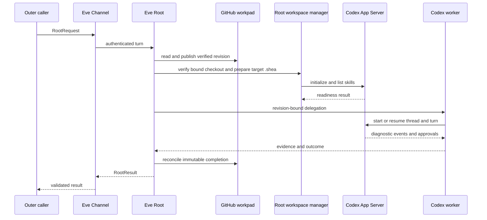

# Architecture Overview

## Responsibility model

FailureReport separates public supervision, domain capability, workspace ownership, diagnosis, and ecosystem transport. The separation is enforced in source and tests, not merely organizational convention.

| Component | Owns | Must not own |
| --- | --- | --- |
| Eve Root | intake, configured tracker routing, report publication, workpad lineage, optional extension selection, source/worktree lifecycle, Codex thread/completion journal, finalization, handoff rendering and delivery | domain skill content, global Codex configuration, target implementation or PR workflow |
| Eve Channels | authenticated ingress and request attribution | workspace selection, diagnostic backend selection, business logic |
| Domain extension | optional instructions, native skills, and deterministic namespaced tools | agent, sandbox, schedule, session, worktree, provider, nested worker |
| Codex worker | diagnosis, focused experiments/tests, evidence and recommendations in assigned `cwd` | choosing checkout/branch, workpad writes, business-code edits, commits, pushes, PRs, finalization |
| Outer adapters | platform-to-`RootRequest` translation and `RootResult` return | importing `eve/agent`, calling extensions/workers directly, reimplementing Root policy |

The [domain extension model](../domain/extensions.md) optionally adds capability to the [runtime workflow](../workflows/runtime-and-workspaces.md); with no selected extension, generic Codex instead uses repository instructions and standard diagnostics. [Integration boundaries](../integrations/boundaries.md) ensure callers reach either path only through Root.

## Runtime topology

The short preflight process and the live diagnostic process are distinct. Root persists state before delegation; after a finish, Root—not Codex—reconciles durable completion state. Details are in [runtime and workspaces](../workflows/runtime-and-workspaces.md).

## Durable versus private state

The GitHub Issue is shared human context. Root never edits its body or a foreign comment. A verified managed-comment lineage stores the structured FailureReport, collaboration binding, portable diagnostic session identity, selected extensions, backend ID, immutable target/base/HEAD, optional Codex thread, completion records, and optional finalized snapshot.

The canonical target checkout is host-only process configuration selected through `--target-workspace` or its service-wrapper environment equivalent. Root verifies that it is the real Git top level whose `origin` matches the report repository, fetches the exact immutable SHA, copies only missing authored defaults into target-owned `.shea` prompts and templates, and derives each private worktree beneath `.shea/worktrees/failureReport/`. On active resume it revalidates origin, containment, real-directory boundaries, detached state, base revision, saved HEAD, and selected skill links. This division is encoded by the [protocol and workpad model](../domain/protocol-and-workpads.md); a caller cannot smuggle or change `cwd`, checkout/worktree paths, branches, or mutable revision selectors through the report.

## Provider and execution boundary

Root uses a tool-capable AI SDK model because it must retain Eve tools and worker routing. The current local-first provider is Eve’s `experimental_chatgpt()` using the signed-in local Codex/ChatGPT session. The direct Codex App Server adapter is reserved for the diagnostic worker because it does not expose Eve’s custom tool schema.

Eve’s sandbox is pinned to `just-bash({ autoInstall: false })` for Root orchestration. Real Git operations and Codex App Server execution occur in controlled host-side helpers under `/eve/agent/lib/`; they are import-only implementation, not another public API. Codex inherits the ambient host Codex state and configuration; Root does not set, copy, or repair Codex Home, credentials, permissions, or global configuration.

Native approval handling is also internal. One session-scoped broker binds at most one live request to the validated report, session, thread, turn, and worktree. Raw commands, arguments, paths, provider request IDs, tokens, and connection state remain on the live transport; durable evidence records only sanitized terminal state. Auto-review changes the reviewer, not filesystem, network, or Root authority.

## Finalization boundary

A complete diagnosis is not automatically finalized. Root explicitly checks a clean detached worktree, allows only its exact native-skill symlinks as untracked state, creates and pushes a non-checked-out `diagnostic/<issue>-<persisted-title-slug>` ref, verifies it, and records `reuse_policy: diagnostic_snapshot_only`.

That snapshot is consumed by deterministic [handoff rendering and optional configured delivery](../workflows/runtime-and-workspaces.md#handoff-rendering-and-delivery), but it is never an implementation branch or PR base. FailureReport may move a Ready Issue to `Todo`; the downstream implementation/review system remains a separate consumer and owner.

## Design evolution visible in git

Recent history explains why the boundaries are strict:

- Clean-checkout development startup was narrowed to build only direct Eve runtime dependencies, avoiding dependency or lockfile mutation (`b0adde1`).
- A deployment-owned, team-authorized GitHub Issue Channel was added without allowing Eve’s stock checkout behavior (`a13ad86`).
- Codex App Server moved to direct host JSONL transport with process-bound native approvals (`b38a245`), replacing weaker assumptions around indirect execution.
- Deterministic, revision-bound handoffs were added as a read-only boundary (`df60918`).
- Worktree paths were removed from public durable state; Root now persists portable identity and re-derives private paths (`c03a369`).
- Workpad publication evolved to append-only provider-bounded continuation and content-addressed chunk groups (`b349101`).

These are current implemented constraints; the direct App Server transport and its process-bound native approval handling are part of the implemented MVP.

## Authoritative anchors

- `/docs/architecture/overview.md` and `/docs/architecture/provider-boundary.md`
- `/eve/agent/agent.ts`, `/eve/agent/instructions.md`, `/eve/agent/sandbox.ts`
- `/eve/agent/channels/eve.ts`, `/eve/agent/channels/github.ts`
- `/eve/agent/lib/diagnostics/target-workspace.ts`, `/eve/agent/lib/diagnostics/target-shea.ts`, `/eve/agent/lib/diagnostics/worktree.ts`, and `/eve/agent/lib/backends/`
- `/eve/agent/subagents/codex/instructions.md`
- `/packages/protocol/src/index.ts` and `/packages/protocol/src/handoff.ts`
