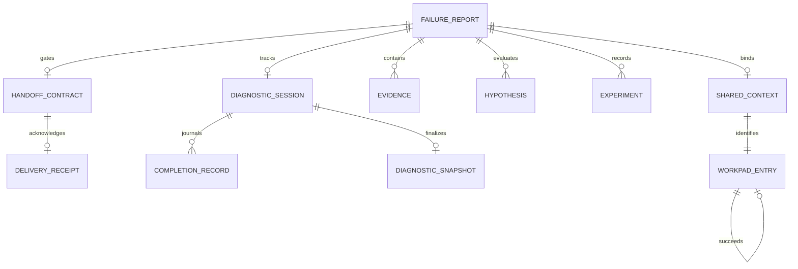
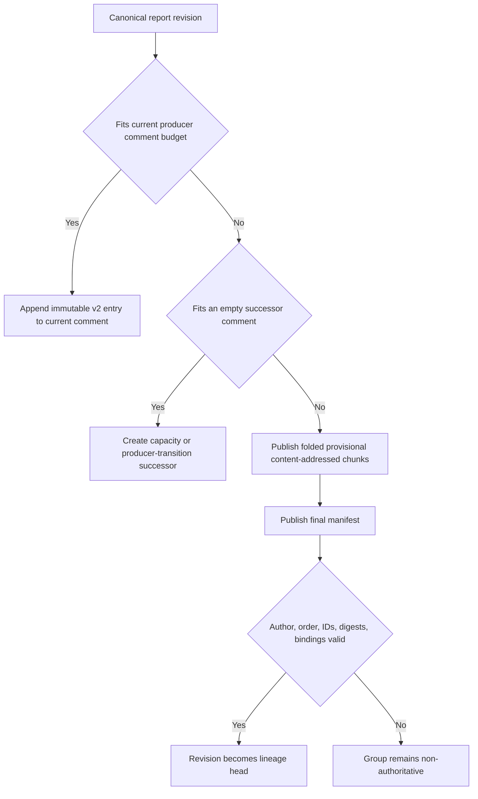

# Protocol and Workpad Lifecycle

`@failure-report/protocol` is the shared strict Zod contract for Root callers, adapters, durable reports, GitHub transport envelopes, diagnostic completions, and handoff outputs. Its canonical sources are `/packages/protocol/src/index.ts` and `/packages/protocol/src/handoff.ts`; this page explains relationships without replacing normative schemas.

## Core entities

The report is versioned `failure-report/v1`. It records identity and timestamps; status/severity/origin; immutable target; inputs and artifacts with sensitivity/retention; attributable evidence; hypotheses and history; decisions and experiments; conclusion; handoff contract; optional shared GitHub context; optional diagnostic session; domain pack metadata; and extension data.

Evidence distinguishes `reported`, `observed`, `derived`, and `verified`, with provenance for phase, source type/reference, collector, and optional method/time. Keep large or sensitive material outside GitHub and store only opaque references.

## Request, result, and target boundaries

Public Root operations are `start`, `resume`, `inspect`, `render_handoff`, and `deliver_handoff`; results are `accepted`, `completed`, `needs_input`, or `failed`. Structured implementation and human-input outputs are mutually exclusive. A `handoff_delivery` receipt is valid only with the matching `implementation_handoff`, and both must carry the same `handoff_id`.

An existing-Issue intake selector contains only repository and Issue number. Root rehydrates URL and managed workpad metadata. `render_handoff` and `deliver_handoff` instead require the caller’s persisted workpad lineage/revision and immutable target binding, then independently reload durable state. The request cannot select delivery policy, tracker coordinates, template, or destination; those remain deployment-owned at the [integration boundary](../integrations/boundaries.md#configured-tracker-and-handoff-delivery).

A target is only `owner/repository` plus a full 40–64 hex Git SHA. Branch names, `HEAD`, checkout/cache/worktree paths, and `cwd` are invalid. This protocol constraint allows the [Root-owned workspace lifecycle](../workflows/runtime-and-workspaces.md) to derive and validate private state rather than trusting a caller.

## Status and readiness semantics

Allowed report statuses are `intake`, `investigating`, `waiting`, `diagnosed`, `todo_ready`, `needs_input`, `inconclusive`, `blocked`, and `superseded`. They are allowed states, not a globally enforced linear state machine; cross-field invariants become strict at session and handoff boundaries.

Exact readiness rules matter:

- `todo_status: ready` requires `gate_decision: Ready`.
- Ready requires the appropriate ready/published handoff state and no material unknown capable of changing scope, solution, guardrails, acceptance criteria, or verification.
- Remaining non-material concerns are explicit `residual_risks`.
- Material uncertainty requires report `needs_input`, handoff `not_ready`, gate `Need to Clarify`, and exactly one human-input specification.
- Required UAT must include explicit UAT steps.

`ready_with_assumptions` and `Ready With Assumptions` are removed, not aliases. Do not weaken uncertainty into an assumed contract.

## Diagnostic session data

A diagnostic session is `active` or `finalized`. It persists selected extension IDs, backend ID, optional write-once Codex thread ID, portable worktree identity/base/HEAD, diagnostic branch slug, immutable completion records, optional sanitized approval evidence, and—for a finalized session—complete remote snapshot metadata with `reuse_policy: diagnostic_snapshot_only`.

It deliberately excludes the host-local worktree path. Exact completion replay is idempotent; incompatible duplicate content or changed report/session/thread/HEAD bindings require input. A finalized session cannot resume.

The [runtime workflow](../workflows/runtime-and-workspaces.md) owns transitions; adapters merely validate and transport the contract as described in [integration boundaries](../integrations/boundaries.md).

## Append-only managed workpads

Current durable transport is `failure-report-workpad-entry/v2`. Each immutable logical entry binds:

- producer ID and immutable GitHub actor ID;
- logical session, entry ID, and global revision;
- exact report and Issue context;
- optional predecessor and continuation metadata;
- a concise human summary plus folded canonical JSON.

Root never edits an Issue body, foreign comment, or prior immutable entry. Marker text alone is not ownership proof. Rehydration requires a configured producer, matching live immutable comment author, schema-valid envelope/payload, exact Issue/report/shared-context binding, and one unambiguous linear lineage.

A valid lineage has one root, one logical session/report identity, contiguous revisions beginning at zero, unique entries, no cycles, no forks, no disconnected candidates, and compatible continuation intent. Copied markers, unknown producers, malformed entries, author mismatch, conflicting lineage, or legacy marker-only comments become `needs_input`.

## Provider-bounded continuation and chunk groups

A same-producer revision appends while the provider-private encoded request remains within the safe budget. When capacity is exhausted, Root creates an explicit `capacity` successor without changing its predecessor. A configured producer change creates a distinct `producer_transition` successor.

A revision too large for an empty comment is split into ordered `failure-report-workpad-chunk/v1` comments. Chunks are provisional and invisible as runtime state. Only a final `failure-report-workpad-manifest/v1` commits the revision after independently binding and verifying producer/live author, logical session, revision/entry/group/predecessor, comment references, chunk order and digests, and full payload digest. The reconstructed bytes must parse through `failureReportSchema`.

Interrupted groups are ignored. A retry may reuse only an unambiguous byte- and provenance-identical group; otherwise it creates another immutable attempt. Provider budgets, comment IDs, and chunk layout do not enter the public FailureReport schema.

## Publication transaction

The GitHub gateway uses optimistic read–prepare–reread–write–readback publication. It retries only verified concurrency or transient readback conditions within a bound; it does not replay stale report snapshots blindly. Octokit is the default transport. The `gh-cli` gateway is an explicit legacy fallback for local diagnostics or fixture capture.

Recent workpad changes are concentrated in commit `b349101`, which added provider-bounded continuation and chunk manifests while preserving append-only provenance. Revision-bound deterministic handoffs arrived in `df60918`, and private worktree-path removal in `c03a369` tightened the public/session schema.

## Handoff delivery receipt

`failure-report/handoff-delivery/v1` is the durable acknowledgement returned only after the configured Issue comment and Project destination have been read back. It binds a SHA-256 delivery ID to the unchanged implementation handoff ID, report/Issue/workpad reference, template content digest, comment reference, Project coordinates, status field, and final `Backlog` or `Todo` state. `RootResult` rejects a receipt without its matching `implementation_handoff` or with a different `handoff_id`.

The receipt is not part of the diagnostic report or append-only workpad lineage, and it does not claim that Shea Symphony or any other consumer implemented, reviewed, merged, or completed the target change. Its derivation and provider-side idempotency are documented at the [configured delivery integration boundary](../integrations/boundaries.md#configured-tracker-and-handoff-delivery).

## Deprecated and compatibility-only contracts

Rejected rather than migrated: legacy marker-only v1 workpads, old `execution_state`, singular `domain_id`, path/branch-bearing worktree state, `submit_action_result`, `waiting_for_approval`, and unstructured `handoff_markdown`. `DiagnosticSessionWorkpad.recordCompletion()` remains a compatibility wrapper for provider code; new Root code should use structured `reconcileCompletion()`.

## Verification anchors

- `/packages/protocol/test/protocol.test.ts`
- `/eve/agent/lib/integrations/github/issue-workpad.ts`
- `/eve/agent/lib/integrations/github/issue-gateway.ts`
- `/eve/agent/lib/integrations/github/octokit-issue-gateway.ts`
- `/eve/test/issue-workpad.test.ts`
- `/eve/test/octokit-issue-gateway.test.ts`
- `/eve/test/diagnostic-completion-reconciliation.test.ts`
- `/eve/test/handoff-renderer.test.ts`
- `/eve/test/handoff-delivery.test.ts`
- `/eve/test/project-tracker.test.ts`
