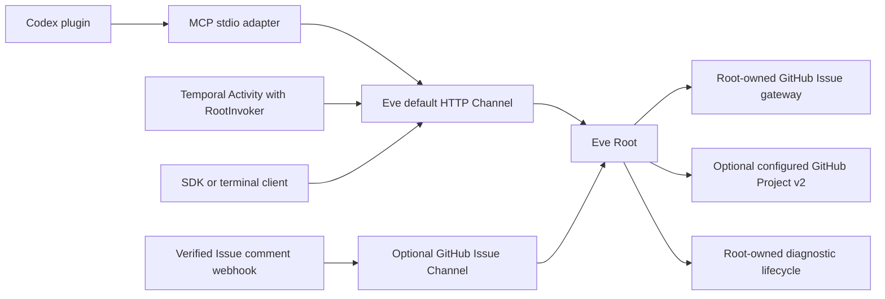
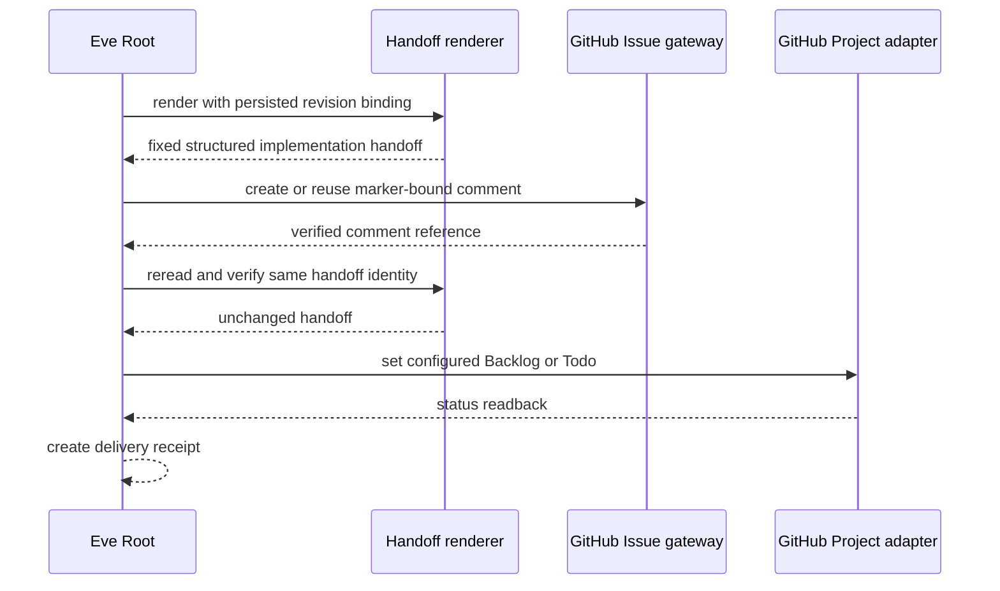
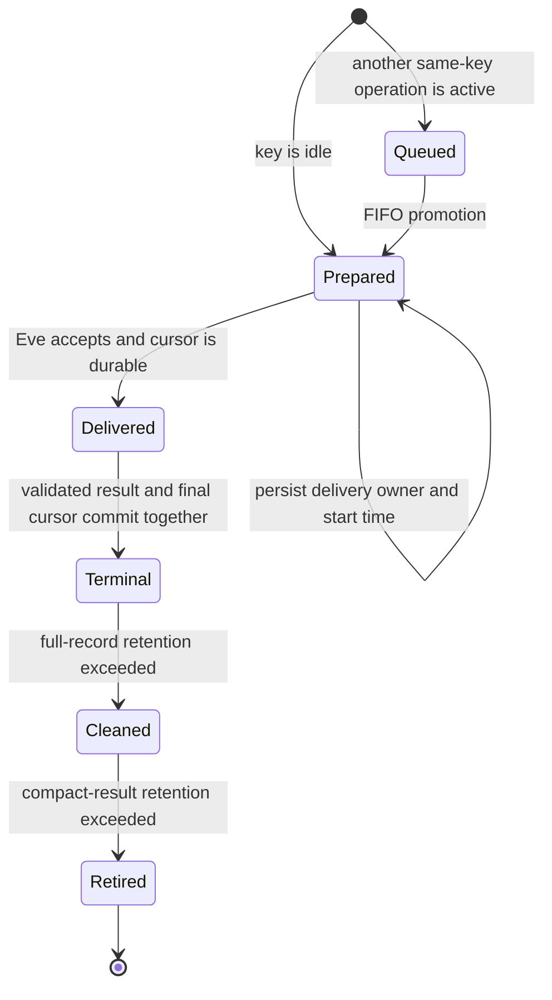

# Integration Boundaries

All integrations converge on Eve Root. They transport or authenticate requests; they do not own FailureReport business logic, domain selection, workspaces, or diagnostic workers. The [architecture overview](../architecture/overview.md) is the canonical ownership map, and the shared payload is the [FailureReport protocol](../domain/protocol-and-workpads.md).

## Integration topology

The GitHub Issue Channel and GitHub workpad gateway are separate: one is optional ingress; the other is Root’s durable collaboration integration.

## Default Eve HTTP Channel

`/eve/agent/channels/eve.ts` exposes Eve’s canonical `/eve/v1/session*` routes to terminal/SDK clients and outer wrappers. It currently composes Vercel OIDC, local development auth, and `placeholderAuth()`. The source explicitly requires replacing placeholder auth before admitting production browser or third-party clients.

Reachable deployment credentials and network policy authorize Root actions. Do not add request-selected repositories, extension/backend selectors, host paths, or a second approval protocol at this layer.

## GitHub Issue Channel

The optional `/eve/v1/github` Channel is disabled unless `FAILURE_REPORT_GITHUB_CHANNEL_POLICY` is valid deployment-owned configuration. It uses Eve’s verified GitHub App webhook handling and dispatches only:

- an initial `@bot` mention on an Issue comment; or
- one direct reply that unambiguously answers the Channel’s one known missing-information request for that Issue.

For every accepted comment it checks active membership in configured organization teams; authorization is never cached. Unconfigured repositories, pending/absent membership, missing permission, API errors, malformed delivery, or webhook failure all fail closed. PR/review comments, CI, Issue-open events, schedules, proactive sends, ordinary unmentioned comments, approval prompts, and ambiguous replies remain inert.

FailureReport overrides Eve’s stock GitHub checkout-on-turn behavior. The Channel may retain bounded progress/reply behavior but never clones, fetches, selects a revision, allocates a sandbox, or passes a checkout path to Root/Codex. Workspace authority remains with the [diagnostic lifecycle](../workflows/runtime-and-workspaces.md).

Deployment policy and credentials must stay outside Issues, workpads, model context, and adapter payloads. Setup details and least-privilege permissions are maintained in `/README.md`; do not copy secret values into documentation.

## Root-owned GitHub gateway

Root uses GitHub Issues as shared context and managed comments as durable report transport. Octokit is the default API client. By default Root obtains the active `gh auth login` token once per process and keeps it in memory; token and GitHub App modes are deployment alternatives. Host Git authentication for source clone/fetch is separate from GitHub API authentication.

The gateway never edits Issue bodies or foreign/prior comments. Producer identity must be configured with immutable GitHub actor IDs, and publication follows the provenance and append-only transaction in [protocol and workpads](../domain/protocol-and-workpads.md). `FAILURE_REPORT_GITHUB_GATEWAY=gh-cli` selects an explicit legacy fallback, not the normal transport.

## Configured tracker and handoff delivery

`FAILURE_REPORT_HANDOFF_DELIVERY_POLICY` is optional deployment-owned JSON keyed by repository. A repository entry fixes a Markdown template plus one GitHub Project v2 owner, number, single-select status field, intake state `Failure Report`, and ready destination `Backlog` or `Todo`. Public requests, Channels, extensions, workers, and models cannot override any of those coordinates. With no matching policy, diagnosis and read-only `render_handoff` remain available; tracker intake is skipped and `deliver_handoff` fails closed.

`begin_failure_report` is Root’s intake mutation. For an accepted new `start` with no managed workpad, it adds the Issue to the configured Project if necessary and moves it to `Failure Report`. It may take ownership only from unset, `Failure Report`, `Need Human Input`, `Backlog`, or `Todo`; active downstream implementation/review states are never regressed. `Failure Report` belongs to FailureReport and is intentionally absent from Shea Symphony’s `state_map`.

`deliver_handoff` reuses the [revision-bound pure renderer](../workflows/runtime-and-workspaces.md#handoff-rendering-and-delivery), then applies configured presentation and routing. Template paths are relative to the Eve application root and must resolve canonically to a non-empty regular file inside it; traversal and symlink escape fail closed. Templates are validated against known variables and required diagnostic, goal, scope, outcomes, and verification fields. They never replace the fixed `failure-report/implementation-handoff/v1`: the complete handoff and deterministic delivery intent are always appended in folded JSON.

The delivery boundary publishes a comment before changing tracker status, and it refuses tracker mutation if the durable handoff changes during that window.

The delivery ID hashes the handoff ID, template content digest, and configured tracker intent. Its versioned marker makes process-loss retry idempotent: Root may reuse exactly one byte-identical comment by the configured producer, but duplicate markers, foreign authors, or conflicting body/template/intent require operator input. It never edits an existing handoff comment. After comment readback, Root rerenders to reject a changed workpad, then the Project adapter resolves exactly one field and option and requires status readback. The `failure-report/handoff-delivery/v1` receipt binds delivery and handoff IDs, report/workpad reference, template digest, comment reference, Project coordinates, and final `Backlog`/`Todo` state. It acknowledges only FailureReport’s boundary—`Todo` makes the Issue eligible for downstream Shea Symphony, while `Backlog` requires manual promotion.

Primary sources: `/eve/agent/lib/delivery/`, `/eve/agent/tools/begin_failure_report.ts`, `/eve/agent/tools/deliver_handoff.ts`, `/eve/agent/lib/integrations/github/project-tracker.ts`, `/packages/protocol/src/handoff.ts`, `/eve/test/handoff-delivery.test.ts`, and `/eve/test/project-tracker.test.ts`.

## MCP adapter

`@failure-report/mcp-adapter` exposes exactly one MCP tool, `failure_report`. It validates `RootRequest` and `RootResult`, invokes the default Eve Channel, and never exposes domain tools, Root’s internal lifecycle tools, or workers as MCP APIs. The local `http://127.0.0.1:2000` fallback is development-only; deployed clients should use explicit host configuration and optional Channel bearer auth.

### Private durable operation ledger

The adapter owns a user-private v2 operation ledger, not just a cursor cache. Its canonical conversation key is `issue:<repository>#<issue_number>` when the request has `issue_selector`, `issue`, or `report.shared_context`; otherwise it uses `report:<report.id>`, then request-local fallback. This keeps initial existing-Issue intake and later rehydrated report calls on one Eve session. Each operation also stores a SHA-256 fingerprint of canonical validated `RootRequest` JSON. A `request_id` is globally owned by one key: matching retries join or replay, while changed payloads, cross-key reuse, corrupt state, or a positive retired-ID filter match fail without delivery.

One durable pump is single-flight per canonical key. Different same-key requests queue FIFO, while unrelated keys have independent pumps and their Eve turns may run concurrently. Before sending, the adapter durably claims `prepared` delivery ownership. Immediately after Eve accepts the message, the transport invokes `onDelivered` and persists the allocated session cursor **before** waiting for the terminal event. The matching validated `RootResult` and final cursor then commit atomically as `terminal`, so recovery sees either a resumable delivered turn or its stored result—not an advanced cursor with a missing result.

A same-process caller with the same ID/fingerprint joins the recorded operation. On process restart, adapter startup scans pending ledgers: `delivered` work is consumed from its persisted cursor without reposting, and queued work resumes in order. A prior `prepared` claim owned by another runtime, a send that might have reached Eve without yielding a durable cursor, unavailable pending-turn consumption, malformed ownership, or inconsistent persisted state blocks that canonical session instead of guessing or redelivering. There is no adapter resend or unblock shortcut for ambiguous ownership.

Retention is bounded per key. Defaults retain 32 full request-bearing `terminal` records, then 128 compact result-bearing `cleaned` records. Older cleaned IDs enter a fixed-size probabilistic retired-request filter and are never delivered again; safety is preferred over availability on a positive match. Embedding hosts may configure `operation_retention`; full retention may be zero, but cleaned retention remains at least one. Cursor-only v1 files migrate in memory and are rewritten as v2 on the first mutation. File writes use a user-private directory/file, synced temporary file, atomic rename, and directory sync. `FAILURE_REPORT_MCP_SESSION_STORE` may select the host-managed path; requests, results, Eve session IDs/tokens, and ownership metadata make the file sensitive private runtime state.

This ledger is strictly an [outer integration](../architecture/overview.md), separate from the public [`RootRequest`/`RootResult`, GitHub workpad, and diagnostic session](../domain/protocol-and-workpads.md). It owns request-delivery idempotency, queueing, Eve cursors, and result replay; Root owns Issue rehydration, workpad publication, extension selection, workspaces, Codex delegation, human-input decisions, finalization, handoff rendering, and configured handoff-comment/tracker delivery. The [existing-Issue operator walkthrough](../workflows/runtime-and-workspaces.md#existing-issue-operator-walkthrough) shows the two lifecycles together without conflating them.

Primary sources: `/packages/mcp-adapter/src/root-operation-store.ts`, `/packages/mcp-adapter/src/eve-channel-root-invoker.ts`, `/packages/mcp-adapter/src/index.ts`, `/README.md`, and `/packages/mcp-adapter/test/root-operation-lifecycle.test.ts`, `eve-channel-root-invoker.test.ts`, and `eve-channel-root-transport.test.ts`.

## Codex plugin

`/packages/codex-plugin/failure-report/` packages the public `failure-report` skill and `.mcp.json`. Its composition is plugin → MCP stdio adapter → Eve default Channel → Root. It neither embeds an Eve agent nor includes the internal CKB diagnostic skill. Runtime host/auth values are optional environment configuration, not plugin-stored credentials.

Do not confuse the plugin-facing skill, which helps callers form public `failure_report` requests, with worktree-local domain-native skills selected by Root.

## Temporal adapter

`@failure-report/temporal-adapter` keeps Temporal Workflow code deterministic. The workflow validates input and invokes one `invokeRoot` Activity. A Worker supplies `createFailureReportActivities(rootInvoker)`, where the `RootInvoker` calls the default Eve Channel.

Eve calls, GitHub I/O, filesystem operations, MCP, and Codex App Server interactions stay behind the Activity through Root. The workflow must not import `eve/agent`, an extension, or a worker, and must not duplicate Root routing. See `/examples/temporal-host/README.md`.

## Integration change checklist

- Does the integration call the default Channel rather than import `eve/agent`?
- Does it transport only `RootRequest`/`RootResult`, with no domain, worker, backend, or path API?
- Are external I/O and credentials confined to the host/Activity/Channel boundary?
- Does ingress fail closed without leaking policy details?
- Are tracker/template/destination choices deployment-owned, with comment and status readback before a receipt?
- Is session continuity private to the adapter and idempotent across restart?
- Are source checkout and worktree lifecycle still exclusively Root-owned?
- Are protocol validation and integration-specific replay/race tests updated?
