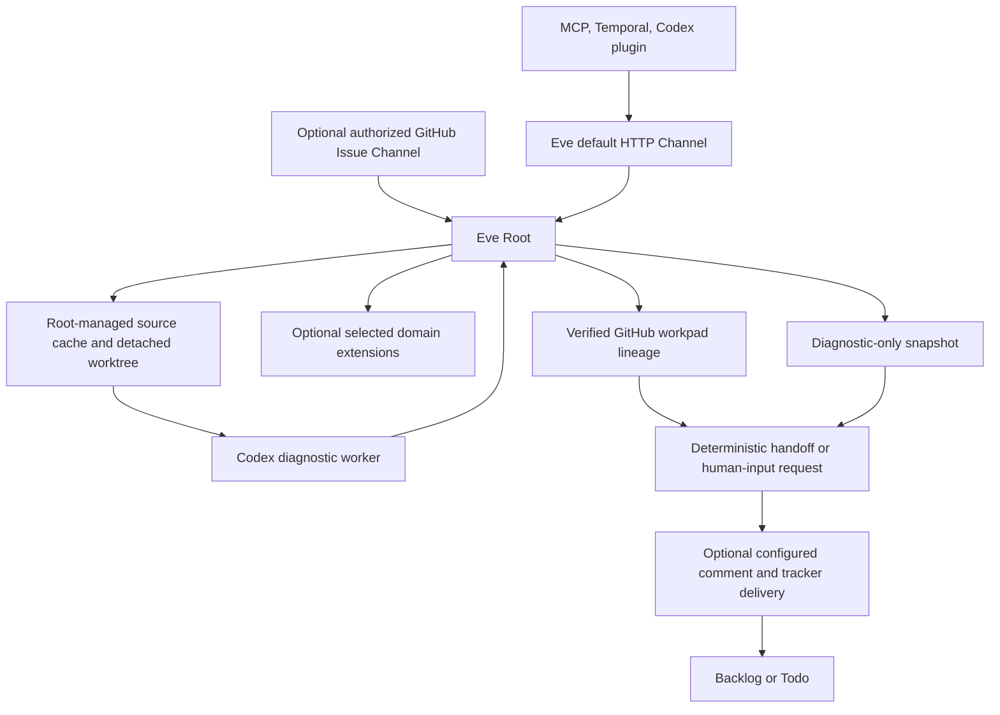

# FailureReport Quickstart

FailureReport is an Eve-supervised “Failure in the Loop” system. It turns an incomplete software failure into a durable, evidence-backed report whose shared context remains one target-repository GitHub Issue from intake through a reviewable implementation handoff. An optional deployment policy can route that Issue through a FailureReport-owned GitHub Project intake state and deliver the Ready handoff to `Backlog` or `Todo`; the current MVP still does **not** implement the target change or open a pull request.

## Non-negotiable boundaries

- **Eve Root is the sole supervisor.** [Eve Channels are ingress and outer packages call the default Channel](integrations/boundaries.md); no adapter or domain package is a second Root.
- **Root owns durable and host state.** It alone publishes the GitHub workpad and manages source caches and detached worktrees under `.eve/sandbox-cache/`; host paths never enter the public protocol.
- **Codex is the one diagnostic worker.** It diagnoses in Root’s assigned worktree and may run focused tests or create ephemeral evidence, but must not change business code, publish workpads, commit, push, create branches, or open PRs.
- **Domain extensions are optional capabilities, not supervisors or prerequisites.** Generic diagnosis persists an empty extension set and uses repository instructions plus standard Codex diagnostics without inventing a placeholder skill. Selected extensions add knowledge, native skills, and deterministic namespaced tools; they do not own providers, sandboxes, worktrees, sessions, or workers. See the [domain extension model](domain/extensions.md).
- **A diagnostic branch is a snapshot only.** `diagnostic/<issue>-<slug>` is a reviewable, finalized diagnostic ref. Future implementation must use a separate worktree and branch and must not open a PR directly from the snapshot.
- **MCP, Temporal, and the Codex plugin are outer adapters.** Their contract is `RootRequest`/`RootResult`, not an internal worker, extension, path, or backend API.

The [architecture overview](architecture/overview.md) assigns every major responsibility, and the [runtime and workspace lifecycle](workflows/runtime-and-workspaces.md) shows how those boundaries execute.

## Developer start

Requirements: Node.js 24+ and pnpm 10.

```bash
pnpm install --frozen-lockfile
pnpm build
pnpm check
pnpm test
```

For a normal local Eve development start:

```bash
pnpm --filter @Alive24/FailureReport dev
```

`dev` first builds only the protocol and CKB domain pack, then runs `eve dev --no-ui`. The default local Channel endpoint used by the MCP adapter is `http://127.0.0.1:2000`. Generated `dist/` and `.eve/` runtime state are ignored; startup must not install dependencies or alter manifests and lockfiles. See [operations, testing, and extension guidance](operations/testing-and-extension.md) for smoke checks, authentication boundaries, failure recovery, and the test matrix.

## Current runtime in one view



This is the implemented topology; outer adapters never bypass Root, and Codex results return to Root for durable reconciliation.

## Documentation map

- [Architecture overview](architecture/overview.md) — components, authority boundaries, current versus future design, and recent design evolution.
- [Source map](architecture/source-map.md) — where authoritative contracts, entrypoints, helpers, packages, tests, and examples live.
- [Runtime and workspaces](workflows/runtime-and-workspaces.md) — optional tracker intake, generic or extension-assisted diagnosis, completion, resume, finalization, handoff rendering/delivery, and the existing-Issue operator walkthrough.
- [Protocol and workpads](domain/protocol-and-workpads.md) — strict report/result schemas, delivery receipts, diagnostic sessions, append-only GitHub lineage, and provider-bounded chunk groups.
- [Domain extensions](domain/extensions.md) — the first-class empty-extension path, CKB’s optional capability set, and safe addition of domains or consumer-owned workers.
- [Integration boundaries](integrations/boundaries.md) — HTTP and GitHub Channels, GitHub Issue/Project gateways, configured handoff delivery, the MCP durable operation ledger, Temporal, Codex plugin, and authority boundaries.
- [Operations, testing, and extension](operations/testing-and-extension.md) — local runbook, recovery rules, privacy, tests, evaluations, and change checklists.

## Status vocabulary

- **Implemented MVP:** Root supervision, strict `failure-report/v1`, v2 append-only workpads, generic diagnosis with zero extensions, optional CKB capability, Root-managed workspaces, direct Codex App Server transport and native approvals, snapshot finalization, deterministic handoff rendering, optional configured GitHub Project intake and handoff delivery, the MCP private durable operation ledger, Temporal wrapper, Codex plugin, and optional team-authorized GitHub ingress.
- **Experimental but current:** Eve’s `experimental_chatgpt()` is the intentional local-first Root provider. “Experimental” is the provider API name, not evidence that the Root boundary is provisional.
- **Planned/separate:** alternate Root providers or sandbox backends, additional installed domain packs, and downstream implementation worktrees/branches. Configured delivery to `Todo` is implemented, but the downstream Shea Symphony implementation/review workflow remains separately owned. Do not describe downstream implementation as FailureReport behavior.
- **Deprecated/unsupported:** marker-only v1 workpads, assumption-dependent readiness, `execution_state`, caller-supplied paths/branches/`cwd`, Root approval-continuation APIs, unstructured handoff Markdown, direct domain-worker APIs, and default `gh api` transport.

## Authoritative sources

Start with `/README.md`, `/docs/architecture/overview.md`, `/docs/architecture/provider-boundary.md`, `/eve/agent/instructions.md`, `/packages/protocol/src/index.ts`, and `/packages/protocol/src/handoff.ts`. The wiki summarizes those contracts; when changing normative behavior, update and test the authoritative source rather than treating this synthesis as a replacement.

## Backlog

- **Shea Symphony automation** — source anchor: `/.shea/README.md` and `/.shea/workflows/shea-symphony.md`; deferred because it is outer project automation rather than the core FailureReport diagnostic runtime, and recent commits mainly update packaged assets/binaries.
- **Evaluation fixture-by-fixture catalog** — source anchor: `/eve/evals/ckb/fixtures/`; deferred because fixtures include immutable or protected evidence and the initial wiki needs only the evaluation contract and safe execution guidance.
