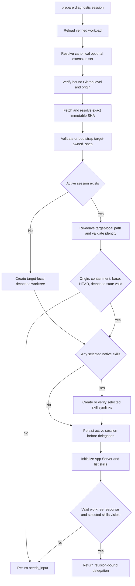
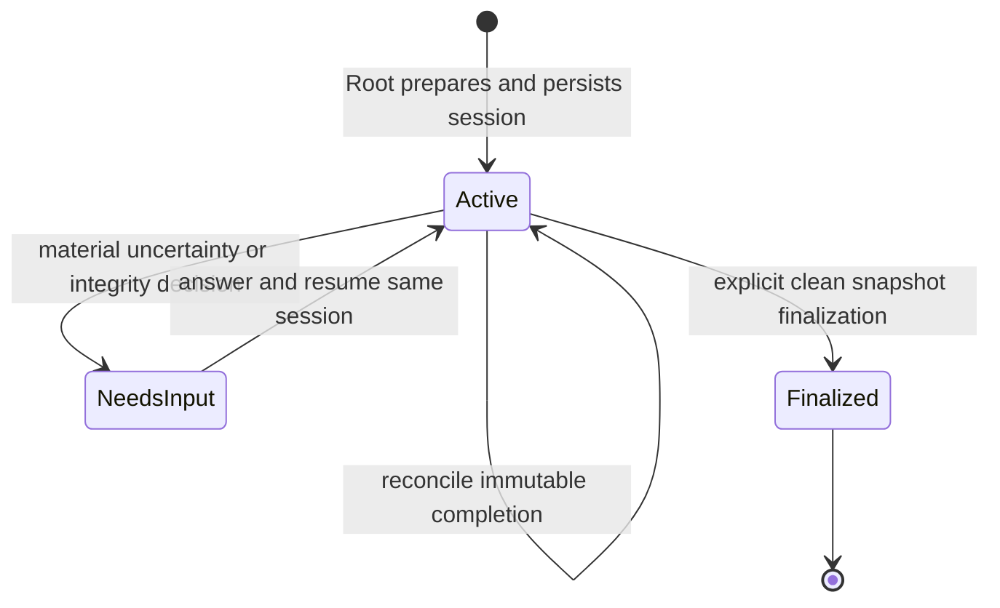
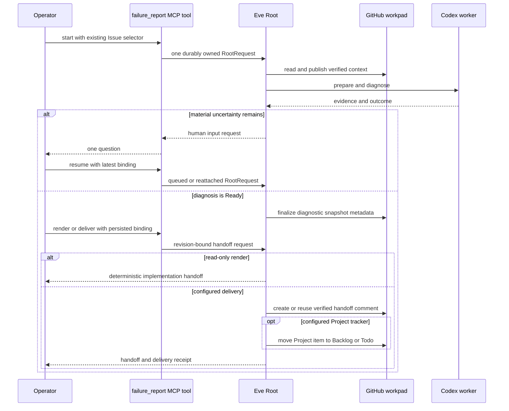

# Runtime and Diagnostic Workspace Lifecycle

This page describes current implemented behavior. The ownership rationale is in the [architecture overview](../architecture/overview.md); durable structures and validation rules are in [protocol and workpads](../domain/protocol-and-workpads.md).

## End-to-end flow

1. An outer caller reaches Eve Root through the default HTTP Channel, or an authorized Issue comment reaches Root through the optional GitHub Channel.
2. For an existing-Issue selector, Root reads the Issue and rehydrates the verified workpad before interpreting the request.
3. On an accepted new `start`, optional deployment policy lets Root route the Issue to the configured GitHub Project’s `Failure Report` state before publishing the first workpad. With no matching policy, tracker-free diagnosis remains valid.
4. Root publishes the current report revision before any diagnostic delegation.
5. Root calls `prepare_diagnostic_session` with only report/Issue identity, a canonical Root-selected domain-extension set—which may be empty—and a bounded request.
6. Root verifies and fetches the process-bound canonical target checkout, prepares its target-owned `.shea` assets without overwriting customizations, creates or restores a deterministic detached worktree beneath `.shea/worktrees/failureReport/`, materializes symlinks only for selected native skills, and persists the active session.
7. A short-lived Codex App Server preflight performs `initialize`, `initialized`, and `skills/list`; no thread or model turn is created, and an empty selected-skill set is valid when the response acknowledges the worktree without errors.
8. Root forwards the returned revision-bound delegation unchanged to the single Codex worker.
9. The worker starts or resumes the persisted Codex thread in the assigned worktree, runs one diagnostic turn, and handles native approvals only over the live transport.
10. Root validates the returned thread and observed HEAD, derives the completion identity, and reconciles one immutable completion record through bounded read–merge–write–readback publication.
11. Root either keeps the same active session for further evidence/human input or explicitly finalizes a clean diagnostic snapshot.
12. A separate read-only `render_handoff` call returns either a deterministic implementation handoff or a human-input request. A configured `deliver_handoff` call may then publish the Ready handoff and move the Project item to `Backlog` or `Todo`.

## Workspace preparation and resume



Preparation fails closed rather than selecting, cloning, or accepting an arbitrary checkout. Startup binds one real canonical Git top-level directory for the process lifetime; Root requires its `origin` and Issue repository to match, then uses only the requested full immutable SHA. It creates the target hierarchy below without overwriting existing files:

```text
<target-canonical-checkout>/.shea/
  .gitignore
  prompts/failureReport/{intake.md,synthesis.md}
  template/failureReport/implementation.md
  worktrees/failureReport/<diagnostic-session>
```

Missing known assets come from `/eve/config/failure-report/`; existing target files always win. Directories and assets must be real, contained, non-symlink paths. The target-owned prompts become Root’s diagnostic guidance, and the handoff template is consumed by configured delivery. This `.shea` layout is a shared workspace convention, not a runtime dependency on Shea Symphony.

The public report target accepts only `owner/repository` and a full immutable Git SHA. Requests cannot supply `HEAD`, branch names, local paths, cache paths, worktree identity/path, backend, skill path, or Codex `cwd`. Root’s fixed extension registry resolves installed package assets, and the worktree receives `.agents/skills/<skill>` symlinks only when safe.

On resume, Root validates report/Issue binding, the exact extension/backend identity, canonical origin, deterministic path, detached state, base SHA, recorded HEAD, and every selected skill link. The empty extension set remains exact session identity; Root must not invent a placeholder extension or silently add one during resume. A missing worktree may be reconstructed only if its recorded HEAD still equals the immutable base. If diagnostic commits existed, recovery needs an explicit operator decision. External HEAD changes, origin drift, attached branches, symlink substitution, and conflicting skill files produce `needs_input`.

## Codex preflight, turn, and approvals

Preflight inherits the ambient host environment and starts the configured `codex app-server` in the validated worktree. It performs readiness only; it never creates a thread, invokes a skill, sends a model request, creates a branch, or changes target business files. Generic diagnosis still performs this gate: `skills/list` must acknowledge the exact worktree with a valid error-free response, but no project skill is required. With selected extensions, every selected skill must additionally appear at repository scope. One fresh-process retry is allowed only for transient startup, handshake, transport, or timeout failures after workspace revalidation. Missing executables, credentials/state access, containment, and selected-skill discovery failures stop before delegation.

The live worker transport starts or resumes the write-once thread ID and verifies echoed `cwd`, approval policy, and sandbox. Current policy is `on-request`, `auto_review`, `workspace-write`, with medium reasoning. `workspace-write` permits focused tests, caches, and ephemeral debugging evidence—not business-code edits, commits, pushes, PRs, or finalization.

The native approval broker permits at most one live request bound to one session/thread/turn/worktree. Permissions requests, stale/duplicate/concurrent requests, timeouts, cancellation, process loss, and mismatched bindings fail closed. A process-bound approval is never replayed after restart. Durable records contain only a broker-generated ID, safe binding, outcome, and timestamp; raw command data remains live-only.

## Completion reconciliation

Codex returns evidence, hypotheses, experiments, conclusions, recommendations, confidence, and artifact references to Root. Root alone creates a `failure-report/diagnostic-completion/v1` record bound to report, immutable target, session, thread, and observed HEAD.

The reconciliation transaction reloads the latest verified workpad, merges or recognizes the record, publishes append-only state, and reads back the committed head. Exact replay is idempotent. Divergent duplicates, changed session/thread/HEAD, conflicting newer state, publication races beyond the bounded retry budget, or failed readback produce `needs_input`; Codex does not retry GitHub writes or replace durable state.

## Session lifecycle and finalization



A finalized session cannot resume. `NeedsInput` is a workflow outcome around an active durable session, not a third `diagnostic_session.lifecycle` enum value.

`finalize_diagnostic_session` rehydrates the extension set from the workpad and verifies a clean detached worktree at the saved HEAD. Only exact Root-managed symlinks for selected native skills may remain untracked; a generic session has no skill-link exception. Root creates and pushes `diagnostic/<target-issue-number>-<persisted-title-slug>` without checking it out or force-moving an existing ref, verifies the remote ref, and records `diagnostic_snapshot_only` metadata.

The snapshot is for review and evidence continuity. It is not an implementation branch, PR branch, or permission to continue diagnosis. Future coding must allocate a separate implementation worktree and branch.

## Handoff rendering and delivery

`render_handoff` accepts persisted identity and expected revision bindings, not a report body to trust. Root reads the latest provenance-verified workpad, checks caller bindings, performs a pure render, and reads again to reject a concurrent lineage change. It does not publish, prepare/finalize, invoke Codex, update a tracker, or create a branch.

A Ready path requires `todo_ready`, exact `Ready`, a finalized session, consistent immutable target/worktree/snapshot/completion HEADs, a valid diagnostic snapshot, completion evidence, and no material unknown. It returns `failure-report/implementation-handoff/v1` with a deterministic content identity.

Material uncertainty follows the mutually exclusive `failure-report/human-input-request/v1` path. It requires `needs_input`, `not_ready`, `Need to Clarify`, an active unfinalized session with persisted thread, confirmed facts, completed/exhausted experiments, eliminated hypotheses, at least two viable options, exactly one question, and a same-session resume condition.

`deliver_handoff` is a separate configured side-effect boundary with the same revision bindings. It first runs the pure renderer, loads the deployment-selected Markdown template as a contained regular file in the process-bound target checkout—defaulting to `.shea/template/failureReport/implementation.md` prepared from the authored default only when missing—and creates or reuses one deterministic marker-bound Issue comment. The template controls only the human view: FailureReport always appends the complete structured handoff and delivery intent in folded JSON.

After comment readback, Root renders again. If the managed workpad or handoff identity changed, it returns `needs_input` and does not mutate the tracker. Otherwise the GitHub Project adapter adds the Issue item if absent, resolves exactly one configured status field and destination option, permits only safe prior states, and moves it to `Backlog` or `Todo` with mandatory readback. `Backlog` waits for manual promotion; `Todo` is the ownership handoff to downstream Shea Symphony or another implementation system. FailureReport never moves directly to implementation-review states and the returned `failure-report/handoff-delivery/v1` receipt acknowledges delivery only—not downstream work.

## Existing-Issue operator walkthrough

This path uses only the public [`failure_report` MCP tool](../integrations/boundaries.md#mcp-adapter). Root’s preparation, finalization, rendering, tracker, and delivery tools remain internal.

1. **Start Eve bound to the target.** From the repository root, run `pnpm --filter @Alive24/FailureReport dev --target-workspace /absolute/path/to/target-checkout`. The launcher rejects a missing, relative, symlinked, or non-directory target, canonicalizes it, and starts `eve dev --no-ui`; the local MCP adapter defaults to `http://127.0.0.1:2000` when no deployed host is configured. That process cannot serve another repository.
2. **Choose a supported client surface.** The packaged end-user route is the Codex plugin at `/packages/codex-plugin/failure-report`, installed through a configured Codex marketplace; its `.mcp.json` starts the stdio adapter and exposes the single `failure_report` tool. For the repository’s marketplace-free OpenSourceIRL path, use the read-only MCP demo client described below rather than claiming an arbitrary local plugin load is supported.
3. **Start from the existing Issue.** Invoke `failure_report` with a new `request_id`, `operation: "start"`, and only an `issue_selector` containing `repository` and `issue_number`. Do not invent the Issue URL, workpad marker, comment identity, revision, Project, field, template, or tracker state. Root reads shared context and returns canonical Issue/report state; a missing workpad is a valid intake state, not permission for the adapter to publish one. Before first publication, a matching deployment policy routes accepted intake to `Failure Report`; no matching policy preserves tracker-free diagnosis.
4. **Preserve canonical context.** Keep the returned Issue, report, workpad lineage, and immutable target bindings. A transport retry of the same logical call reuses the same `request_id` and byte-equivalent request data so the adapter joins or redrains it; a distinct Root action uses a new `request_id`. Reentry with `resume` or `inspect` uses Root’s latest returned durable binding rather than reconstructed values.
5. **Resume after human input.** If Root returns `needs_input` with `failure-report/human-input-request/v1`, answer its one question in a new `resume` request using the latest binding. Root—not MCP—preserves the active managed worktree and write-once Codex thread and decides whether more diagnosis is required.
6. **Let Root finalize explicitly.** Once diagnosis is complete and Ready, Root calls its internal finalizer. Finalization requires the clean detached worktree and pushes the verified `diagnostic/<issue>-<slug>` snapshot without checking it out. Inspect the latest workpad/result metadata for `lifecycle: finalized`, the remote snapshot ref and commit, and `reuse_policy: diagnostic_snapshot_only`; `inspect` may rehydrate that state without starting implementation.
7. **Render or deliver the handoff.** Use `operation: "render_handoff"` with the latest persisted report/workpad/target binding for a read-only preview; an Issue selector alone is insufficient. Use a new `request_id` with `operation: "deliver_handoff"` only when the configured publication and tracker side effects are wanted. Root returns either another human-input decision or the unchanged `failure-report/implementation-handoff/v1` plus a matching `failure-report/handoff-delivery/v1` receipt. If the destination is `Backlog`, stop for manual promotion. If it is `Todo`, downstream Shea Symphony may claim the Issue; FailureReport itself does not start or attest implementation.



The walkthrough ends at a reviewable diagnostic snapshot and either a rendered handoff or a verified delivery to `Backlog`/`Todo`. FailureReport does not implement the target change, create an implementation branch, or open a pull request.

## OpenSourceIRL read-only entrypoint and completed CKBoost path

The current repository demo procedure starts an isolated presentation process that reuses prebuilt Eve output while avoiding historical `eve/.eve` workflow state:

```bash
cd eve
pnpm exec eve build --skip-sandbox-prewarm
pnpm run demo:start -- --target-workspace /absolute/path/to/CKBoost
```

`demo:start` validates the target binding, creates a fresh temporary app root, symlinks the authored agent and production output into it, and runs `eve start` on `127.0.0.1:2000`. With Eve running, the marketplace-free live entry is:

```bash
export FAILURE_REPORT_EVE_HOST="http://127.0.0.1:2000"
export FAILURE_REPORT_MCP_SESSION_STORE="/tmp/failure-report-opensourceirl-mcp.json"
pnpm --filter @failure-report/mcp-adapter demo:existing-issue -- Alive24/CKBoost 56
```

The client launches the real MCP stdio adapter and sends `operation: "inspect"` with only the repository and Issue number plus an explicit no-mutation instruction. It does not replay diagnosis, invoke Codex, render or redeliver the handoff, move a tracker, or change branches. The exact setup, visible checkpoints, live-write policy, and recovery sequence are maintained in `/docs/demos/opensourceirl-2026-07-31-runbook.md`, which is the authoritative current repository demo procedure.

The tracked readiness record documents the completed CKBoost #56 product path: Root reentered the existing append-only workpad, classified the remaining timezone and uncaptured-live-transaction uncertainty as non-material residual risk, reached revision 7 with `todo_ready` and `gate_decision: Ready`, preserved the finalized diagnostic-only snapshot, deterministically rendered the revision-bound handoff, and created human-readable Issue comment `5104104249` with folded structured data. CKBoost configured `tracker: null`, so delivery did not add or move a Project item. This demonstrates diagnosis through a bounded implementation contract; it does not prove or perform the downstream fix, implementation branch, pull request, review, or merge.

## Primary implementation and tests

- Tools: `/eve/agent/tools/prepare_diagnostic_session.ts`, `finalize_diagnostic_session.ts`, `render_handoff.ts`, `begin_failure_report.ts`, `deliver_handoff.ts`
- Lifecycle: `/eve/agent/lib/diagnostics/session-preparer.ts`, `target-workspace.ts`, `target-shea.ts`, `worktree.ts`, `workpad.ts`, `session-finalizer.ts`, `handoff-renderer.ts`; configured delivery under `/eve/agent/lib/delivery/`
- Backend: `/eve/agent/lib/backends/codex-app-server-*.ts`, `native-approval-broker.ts`
- Worker contract: `/eve/agent/subagents/codex/instructions.md`
- Tests: `/eve/test/codex-diagnostic-session.test.ts`, `target-workspace.test.ts`, `target-shea.test.ts`, `host-managed-workspace.test.ts`, `development-entrypoint.test.ts`, `codex-app-server-preflight.test.ts`, `codex-app-server-direct-transport.test.ts`, `native-approval-broker.test.ts`, `diagnostic-completion-reconciliation.test.ts`, `handoff-renderer.test.ts`, `handoff-delivery.test.ts`, `project-tracker.test.ts`
